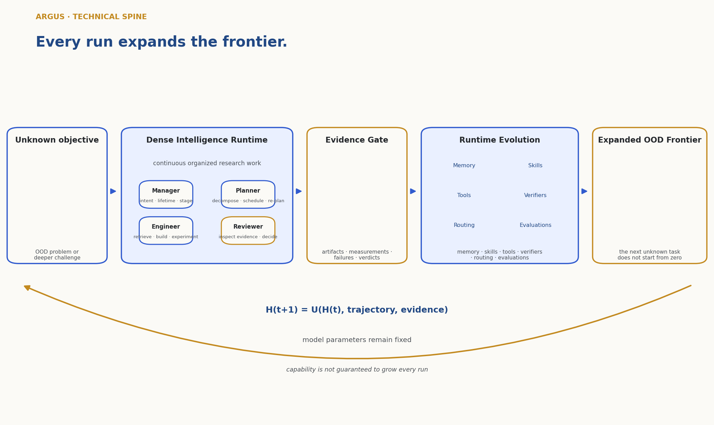

<h1 align="center">Argus: Autonomous Research Generation and Understanding System</h1>

<p align="center"><strong>English</strong> · <a href="README.zh-CN.md">简体中文</a></p>

> **Every run expands the frontier.**

<p align="center">
  
</p>

Argus is an autonomous-research runtime that keeps decision, execution, and
verification coupled over long horizons. Four persistent, model-driven roles
sustain **dense intelligence** across a continuous loop; every run's
reviewer-verified **evidence** updates durable **runtime state** — memory,
skills, tools, verifiers, routing, and evaluations — with the model's parameters
held fixed; and the enlarged runtime meets the next out-of-distribution
objective from a higher floor. That single spine — dense intelligence, evidence,
runtime evolution, an expanding frontier — is what this project is built and
measured on.

## Dense Intelligence for Long-Horizon Research

Model intelligence is sparse in time. A capable coding-and-reasoning model is
brilliant for the length of a single call and then stops: the reasoning that
produced an insight evaporates when its context is dropped or lossily compacted,
and the next call begins again with no durable trace of what was learned. A
longer context window only postpones the moment the episode ends. Long-horizon
research is the opposite of a single call — thousands of coupled decisions
sustained over hours to days, where value comes not from one clever step but from
keeping judgment, execution, and verification connected across all of them.

Argus makes intelligence **dense** by running four persistent, model-driven roles
as a continuous loop over persisted project state. A Manager fixes intent and
lifetime, a Planner decomposes and schedules, an Engineer retrieves and builds and
experiments, and a Reviewer inspects the evidence and decides. Because the loop
never dissolves back into a stateless call, decision, execution, and verification
stay coupled, so the system can carry a thread of research reasoning far past the
horizon at which an episodic agent would have forgotten why it started. We write
this intended density as `rho_DI(T)`, a conceptual measure of how much coupled
decision, execution, and verification a system sustains over a horizon `T`. It is
an explanatory construct for what the runtime is designed to maximize — not a
reported benchmark metric, and not a score of universal superiority over models,
humans, or other systems.

## From Work to Evidence to Runtime Evolution

Continuity alone is not enough; it has to compound. Every run deposits verified
evidence, and the Reviewer gates what counts, so only checked results change the
system. Those results update the **runtime state** the fixed model reads and
writes — its memory, skills, tools, verifiers, routing, and evaluations — which
the technical report writes compactly as `H(t+1) = U(H(t), trajectory,
evidence)`. This is **Runtime Evolution**: the system grows more capable not by
retraining a model but by accumulating audited, reusable capability around it.
Every update is attributable — it names a source, an authoritative owner, and a
named persistence surface. That ownership is honestly scoped, not universal: only
for the memory and skills a mission *earns* is the owner a distinct role — the
**Reviewer certifies** work it did not author, the same work-versus-certification
separation that governs completion. The rest are **operator-owned** (tools),
**Planner-owned** with the Reviewer **feedback-only** (verifiers), or
operator-sourced-and-Manager-committed (routing) and
Planner-authored-and-scheduler-committed (evaluations).

Two boundaries keep this claim honest. First, runtime evolution
**does not require online parameter training**: the underlying model's weights
are held fixed for the campaign (`theta_(t+1) = theta_t`), no gradient step is
taken on the base model, and no weight-level learning is claimed anywhere.
Second, the design **does not guarantee that every run adds capability** — a run
may fail, return only a negative result, or add nothing verified. Even then it
can add durable value by recording what not to repeat, which trims future
duplicate search. Retained capability is evidence-gated and revisable through an
ordinary reinforce–distill–revise–retire lifecycle, not empirically monotone.

The consequence is out-of-distribution reach. When the next task arrives, the
runtime it inherits already carries the skills, tools, and verifiers earned on
prior problems, so the next unknown objective does not start from zero. Each
verified increment enlarges the frontier of problems the system can attempt.

## Evidence from the Frontier

Argus keeps a live public record at
[argusbot.cn/results.html](https://argusbot.cn/results.html) and
[argusbot.cn/research.html](https://argusbot.cn/research.html). Human records,
human-authored baselines, and paper-reported best results are the primary
references; the machine-readable snapshots are committed in
[`technical_report/evidence/website_results.json`](technical_report/evidence/website_results.json)
and
[`technical_report/evidence/paper_inventory.json`](technical_report/evidence/paper_inventory.json).

| Arena | Protocol | Argus result | Primary reference | Evidence tier |
|---|---|---:|---|---|
| NVIDIA SOL-ExecBench | B200 · 101 kernels | Global #6 · 2× #1 · 7 top-3 | Public leaderboard rank | Website snapshot |
| nanochat · B200 | 5 min · 1×B200 · 426 attempts | **0.9636 BPB** | Human SOTA: 0.9646 | Artifact digest |
| nanochat · H100 | 5 min · 1×H100 · 37 mechanisms | **0.9855 BPB** | Human SOTA: 0.9879 | Website snapshot |
| nanoGPT speedrun | 8×H100 · N=10 | **79.77 s** | Same-device human #83: 80.18 s | Artifact digest |
| AARRI-Bench | 82 research-intern tasks | **63/82 · 76.8%** | Paper-reported best: 68.3% | Website snapshot |
| Arbor · RUC NLPIR | Math-Reasoning Data | **28.0 gap** | Arbor: 20.83 | Website snapshot |

Each row is a scoped claim under its own protocol and unit; the arenas measure
different quantities and are never cross-normalized. Two rows — the nanoGPT
speedrun and nanochat on B200 — carry committed artifact-digest records: a ten-run
verifier line (`valid=true`, `p=0.004007`, `79.77±0.06 s`, `seal=ok`) and a
frozen-scorer, one-seed `MEAN_VAL_BPB=0.963634`. This repository stores their
logical artifact IDs and SHA-256 digests, not the artifact bytes. The other four
rows are website snapshots and are labeled accordingly.

Separately, the public research portfolio contains **41 de-duplicated papers
across six programs**: 35 manuscripts and 6 drafts, spanning cognitive bias in
LLMs (9), multimodal and vision-language models (16), LLM agent methods (5),
efficiency/compression/decoding (7), world models (2), and state trace and
auditability (2). This is an output inventory compared only to human-authored
literature, not an acceptance count; Argus makes no claim that any of the 41
papers have been accepted. Every benchmark claim is treated as a protocol-scoped
measurement that retains its benchmark version, hardware and software environment,
baseline definition, commands, exit status, repeated-run statistics where
applicable, and the hashes of the artifacts that support it.

## How Argus Makes the Loop Real

The runtime is organized into three cooperating planes: a **control plane** for
intent, planning, scheduling, budgets, and daemon lifecycle; an **execution
plane** for search, code, experiments, and independent review; and an **evidence
plane** of durable state (`events.jsonl`, `checkpoint.json`, the journal,
evidence bundles, and figure manifests). Four model-driven roles act across those
planes through explicit interfaces:

| Role · plane | System responsibility | Decision boundary |
|---|---|---|
| **Manager** · control | Front door for operator intent; selects lifetime and vertical; owns pipeline-stage transitions | Other roles may recommend a stage change but cannot apply it |
| **Planner (L4)** · control | Builds and revises the work backlog; schedules certification work when required | Produces structured tasks and project-level planning verdicts |
| **Engineer (L1)** · execution | Executes one bounded round using real files, tools, searches, and hardware | Produces artifacts and a concrete continuation request |
| **Reviewer (L2)** · execution → evidence | Inspects artifacts and logs against the active checklist | Returns `done`, `continue`, or `blocked`; the sole authority on completion |

The append-only event tape is the canonical timeline, so an operator can move
from a published number to its mission, round, review verdict, command record,
and artifact set without trusting a prose summary. A mission moves through a
durable lifecycle — an operator request is interpreted, planned into backlog
items, atomically claimed, executed through Engineer–Reviewer rounds, and returned
as complete, blocked, paused, or ready for more planning — and after a controlled
restart the daemon resumes the same campaign only when its persisted identity
matches the current objective, vertical, and lineage. The runtime treats
reliability as a first-class concern: one host-global daily USD cap with atomic
call reservations, plus host-concurrency limits; bounded retry and backoff for backend failures
instead of success-looking fallbacks; a Reviewer-authored, hard-capped
`checkpoint.json` that carries curated working memory across bounded session
rolls; and credential redaction before events and artifacts enter review.
Evaluation inputs may be randomized when a fixed known input distribution would
otherwise permit hard-coded optimization. These mechanisms govern execution; they
never score novelty, choose ideas, or infer completion from keywords. Scientific
quality stays a structured agent decision grounded in the artifacts of the run.

## Quick Start

Argus requires Python 3.11 or newer and one supported agent CLI.

For GitHub Copilot subscribers:

```bash
npm install -g @github/copilot
copilot login
```

```bash
git clone https://github.com/lbx154/argus-skill.git
cd argus-skill
python -m venv .venv
. .venv/bin/activate
pip install -e .
argus-skill --setup  # defaults to Copilot when it is the only supported CLI on PATH
```

The setup wizard creates a trusted baseline machine-policy prompt when none
exists. It never overwrites operator-authored prompts. Customize the generated
directive when the machine has additional house rules:

```bash
${EDITOR:-vi} ~/.argus-skill/special_prompts/10-house-rules.md
```

Start a continuous project from its working directory:

```bash
mkdir -p ~/research/world-models
cd ~/research/world-models
argus-skill --daemon --continuous \
  --objective "World Model for Agent Action Selection"
```

Use `argus` for the interactive TUI cockpit, or inspect a running project with
`argus-skill --status`, `--watch`, and `--follow`. Argus can also run under a
user-level service manager for persistent operation; controlled replacement
preserves the campaign identity and never silently re-plans an active objective
during an upgrade.

Argus targets three interchangeable agent-CLI backends:

| Backend | Configuration value | Installation | Authentication |
|---|---|---|---|
| GitHub Copilot CLI | `copilot` | `npm install -g @github/copilot` (Node.js ≥ 22) | Interactive GitHub device authorization |
| OpenAI Codex CLI | `codex` (default) | `npm install -g @openai/codex` | See [`docs/API_CONFIG.md`](docs/API_CONFIG.md) |
| Claude Code | `claude` | `npm install -g @anthropic-ai/claude-code` | Interactive login |

Set `ARGUS_SKILL_RUNNER_BACKEND`, or switch the backend and model from the
cockpit without restarting the project.

## Technical Report, Limitations, and Provenance

The architecture, role interfaces, mission state machine, evidence methodology,
runtime-evolution formalism, six public arenas, and 41-paper portfolio are
documented in full in:

**[Argus: Autonomous Research Generation and Understanding System —
Technical Report 0.3](technical_report/argus-technical-report.pdf)**

The LaTeX source is under [`technical_report/`](technical_report/) and rebuilds
with `make -C technical_report clean all`.

Argus is under active development, and its guarantees are deliberately bounded.
Research quality remains limited by the underlying models, tools, data, and
compute. The Reviewer is a single fallible completion authority. Four of the six
public arena results do not yet have artifact-digest corroboration, and even the
two corroborated rows reference external project artifacts rather than storing
their bytes here. Benchmark integrity must be engineered separately for each
protocol, continuous operation has real compute and provider cost, and the
current evidence system provides content hashes and provenance manifests, not
cryptographic result signing. Treat every performance number as a scoped result
under its stated protocol, not as a universal capability guarantee.

Package metadata declares the project under the MIT license. It builds on
[skill-agent](https://github.com/lbx154/skill-agent) for skill matching and
distillation, and on [ArgusBot](https://github.com/waltstephen/ArgusBot) for the
reviewer loop and CLI runner, with vendored provenance and license material under
[`argus_skill/agent_cli/`](argus_skill/agent_cli/).
