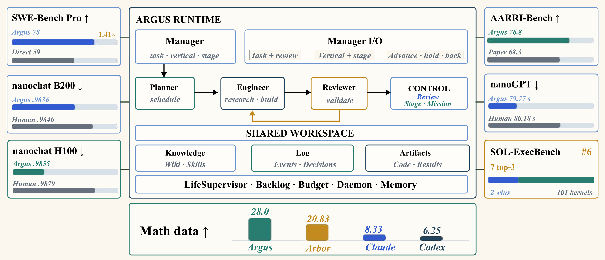
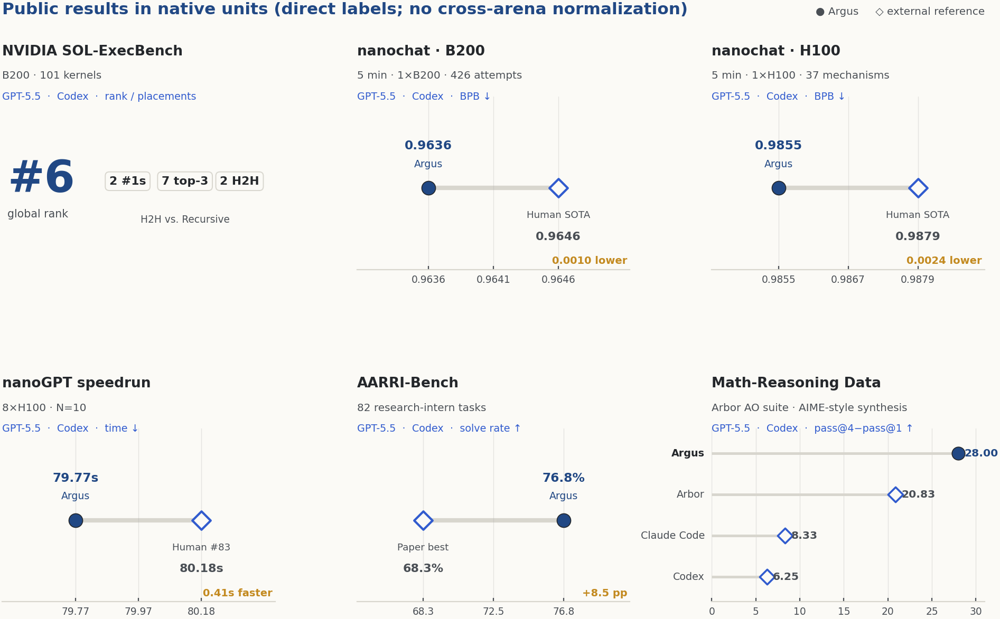
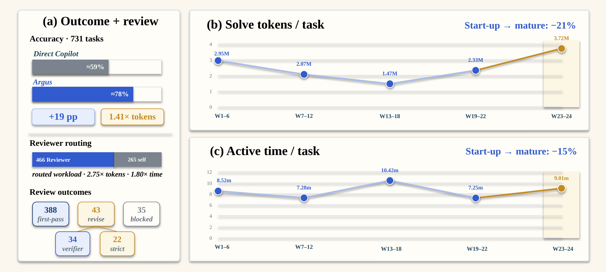
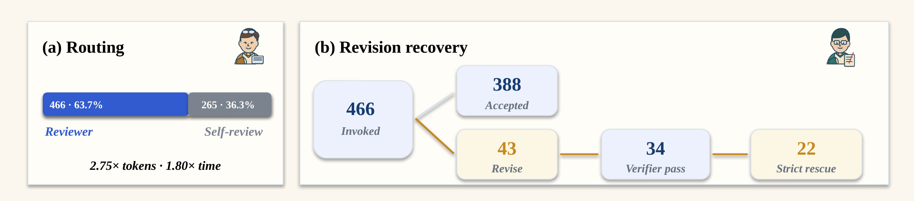
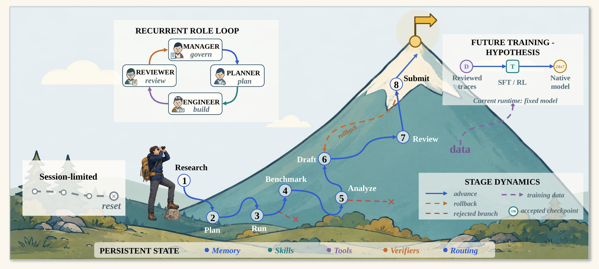

<div align="center">

# Argus

### A general-purpose agentic runtime for long-horizon research

**Long-horizon reasoning is not a race to push farther along a fixed route.**<br/>
Argus persists while the evidence supports the current approach — and pivots, on the record, when measurement proves the route is wrong.

[](https://argusbot.cn/)
[](technical_report/argus-technical-report.pdf)
[](https://argusbot.cn/results.html)
[](https://www.python.org/)
[](LICENSE)

**[Website](https://argusbot.cn/)** ·
**[How it works](https://argusbot.cn/how.html)** ·
**[Results](https://argusbot.cn/results.html)** ·
**[Research](https://argusbot.cn/research.html)** ·
**[Use cases](https://argusbot.cn/use-cases.html)** ·
**[Get started](https://argusbot.cn/start.html)** ·
**[Technical Report](technical_report/argus-technical-report.pdf)**

[English](README.md) · [简体中文](README.zh-CN.md) · [中文网站](https://argusbot.cn/zh.html)



<sub><b>The Argus runtime and its breadth evidence.</b> Manager holds authority over tasks, research verticals and stage transitions; Planner, Engineer and Reviewer operate over a shared workspace whose knowledge, event log, artifacts, backlog, budget, daemon and memory persist across bounded missions. The surrounding cards report seven task-native evaluations on independent scales — breadth evidence, not a single normalized leaderboard. <a href="docs/assets/argus_teaser.pdf">Vector PDF</a></sub>

</div>

---

## Table of contents

- [Why Argus](#why-argus)
- [Results](#results)
- [How it works](#how-it-works)
- [Installation](#installation)
- [First mission](#first-mission)
- [Using Argus](#using-argus)
- [Supported backends](#supported-backends)
- [Model backbones](#model-backbones)
- [Configuration](#configuration)
- [Repository layout](#repository-layout)
- [Technical report & citation](#technical-report--citation)
- [Contributing](#contributing)
- [License](#license)

---

## Why Argus

Most agent frameworks optimize a single turn: one prompt, one tool loop, one answer. Research does not work that way. A real campaign runs for days, produces artifacts that must survive process restarts, and regularly discovers that the plan it started with was wrong.

Argus is built around one uncomfortable fact: **a change of direction is indistinguishable from rationalized failure unless it is governed.** So every pivot in Argus must be evidence-backed, admitted through a role-separated gate, and recorded with its justification.

That single constraint drives the whole design:

| Problem in long-horizon agents | What Argus does |
| --- | --- |
| The agent forgets what it already tried and re-reads the same files forever | **Durable project state** — memory, skills, checkpoints, event log, backlog and artifacts live on disk, not in a context window |
| Context grows without bound until the session degrades | **Fresh sessions + curated handoff** — autonomous role calls never resume a thread; a Reviewer-audited working-memory checkpoint carries what the next session needs |
| The agent marks its own homework | **Role separation** — an independent Reviewer decides `done` / `continue` / `blocked` against artifacts and checks, never the Engineer |
| A wrong route is followed to the end, or abandoned on a whim | **Verified pivoting** — the Manager admits a material change of objective only with evidence and authority, and the reason is written down |
| Sessions reset all learning | **Fixed-model runtime self-evolution** — reviewed outcomes accumulate in memory, skills, procedures, verification state and routing while model weights stay frozen |
| Someone has to babysit it | **7×24 daemon** — after the initial assignment, ordinary rounds run unattended; only operator-owned decisions escalate |

Four persistent roles cooperate over that shared, durable workspace:

- **Manager** — interprets operator intent, selects the workflow, owns stage transitions and the evidence-and-authority gate for changing the objective.
- **Planner** — decomposes the objective into executable tasks and the evidence each task must produce.
- **Engineer** — researches, implements, runs experiments and produces artifacts.
- **Reviewer** — independently checks correctness, evidence, limitations and completion, and audits the memory handed to the next session.

---

## Results

All numbers below use **GPT-5.5** as the backbone and the **Codex** backend, reported in each arena's native units. They are *breadth evidence across seven task-native arenas*, not a single normalized leaderboard — the bars use independent scales.

| Arena | Protocol | Argus | Reference | Δ |
| --- | --- | --- | --- | --- |
| **SWE-Bench Pro** | 731 tasks | **≈78%** | Direct Copilot ≈59% | **+19 pp** at 1.41× tokens |
| **NVIDIA SOL-ExecBench** | B200 · 101 kernels | **Global #6** · 2× #1 · 7 top-3 | — | 2 head-to-head wins over Recursive |
| **nanochat · B200** | 5 min · 1×B200 · 426 attempts | **0.9636 BPB** | Human SOTA 0.9646 | 0.0010 lower ↓ |
| **nanochat · H100** | 5 min · 1×H100 · 37 mechanisms | **0.9855 BPB** | Human SOTA 0.9879 | 0.0024 lower ↓ |
| **nanoGPT speedrun** | 8×H100 · N=10 | **79.77 s** | Same-device human #83: 80.18 s | 0.41 s faster ↓ |
| **AARRI-Bench** | 82 research-intern tasks | **63/82 · 76.8%** | Paper-reported best 68.3% | +8.5 pp ↑ |
| **Arbor · RUC NLPIR** | Math-reasoning data synthesis (AIME-style) | **28.0** | Arbor 20.83 · Claude Code 8.33 · Codex 6.25 | pass@4−pass@1 gap ↑ |

<div align="center">


<sub>Public results in native units — direct labels, no cross-arena normalization. <a href="docs/assets/public_results.pdf">Vector PDF</a> · <a href="https://argusbot.cn/results.html">Live results page</a></sub>
</div>

### Runtime self-evolution under a fixed model

The SWE-Bench Pro run doubles as an observational study of what improves when the *weights do not*. Reviewed updates accumulate in memory, skills, procedures, verification state and routing across 22 completed Waves:

<div align="center">


<sub><a href="docs/assets/swebench_evolution.pdf">Vector PDF</a></sub>
</div>

- **−21%** solve input tokens per task (2.95M → 2.33M) from the W1–6 startup window to the mature W19–22 window.
- **−15%** active workflow time per task (8.52 min → 7.25 min) over the same windows.
- **The trajectory is not monotone.** Task-composition shifts and late difficult-task Waves produce visible reversals — W23–24 rises to 3.72M tokens and 9.01 min. We report this rather than truncating at the best window.

### What the Reviewer actually catches

Of 731 tasks, the Reviewer was invoked on **466 (63.7%)**; the rest were self-routed.

| Outcome | Count |
| --- | --- |
| Accepted first pass | 388 |
| Revision requested | 43 |
| Blocked | 35 |
| → later passed the **official verifier** after revision | **34** |
| → completed the strict review-loop rescue | **22** |

Review is not free: routed workload costs **2.75×** tokens and **1.80×** time. Those 34 verifier recoveries are what that buys.

<div align="center">


<sub>Reviewer routing and revision recovery. <a href="docs/assets/reviewer_mechanism.pdf">Vector PDF</a></sub>
</div>

### Six-project paper-production case study

A long-horizon campaign reconstructed from runtime state: **640 campaign-hours**, **254 missions**, **576 rounds**, **89 session rolls**, **16 rollbacks**, **436 review snapshots**, and **6 of 6** manuscripts completed. Its representative 163.6-hour trace turns *seven rejected method routes* into a 4,500-row negative-results study, then survives two submission-stage rollbacks before completion.

> The retained trajectories also form structured training data for future supervised and reinforcement learning.

---

## How it works

<div align="center">


<sub>One mission, from research to submission — with rollbacks, rejected branches, and persistent state that outlives any single session. <a href="docs/assets/horizon_mountain.pdf">Vector PDF</a></sub>
</div>

A mission moves through stages (**research → plan → run → benchmark → analyze → draft → review → submit**). At each stage:

1. **Planner** turns the current objective into concrete tasks plus the evidence each must produce.
2. **Engineer** executes a round: reads state, acts, runs checks, and proposes a working-memory handoff.
3. **Reviewer** independently returns `done` / `continue` / `blocked` against artifacts and check output, and *audits* the proposed handoff into the next canonical checkpoint.
4. **Manager** decides whether the stage advances, holds, or rolls back — and is the only role that may admit a material change to the objective.

Two properties matter more than the diagram:

- **Every autonomous call starts from a fresh session.** Engineer and Reviewer threads are never resumed. Continuity comes from durable on-disk state plus an explicit, audited handoff — not from an ever-growing context window that lossy auto-compaction silently erodes.
- **Deletion is detoxification.** The working-memory checkpoint has a hard size limit enforced in code, not just in the prompt. Ground truth lives in on-disk artifacts and can always be re-read; the checkpoint only carries what the next session actually needs.

---

## Installation

### Requirements

| | Requirement |
| --- | --- |
| **Python** | 3.11 or newer |
| **Node.js** | 22 LTS or newer *(the agent CLIs require it; the Argus launcher itself needs ≥ 18)* |
| **OS** | Linux or macOS for source installs · Linux / Windows x64 for the npm beta |
| **Backend** | At least one supported agent CLI, installed **and authenticated** |
| **Git** | Required — Argus works in real worktrees |

> **You must install and log in to an agent CLI.** Argus does not ship a model; it *drives* a coding-agent CLI you already have access to. See [Supported backends](#supported-backends).

### Option A — npm beta (fastest)

A binary-only build for Linux x64 and Windows x64. No Python toolchain needed.

```bash
# 1. install and authenticate a backend (GitHub Copilot shown)
npm install -g @github/copilot
copilot login

# 2. install Argus
npm install -g @argusevolve/argus@beta

# 3. configure and launch
argus --setup --non-interactive --backend copilot --accept-house-rules
argus
```

### Option B — from source (recommended for development)

```bash
git clone https://github.com/lbx154/Argus.git
cd Argus

python3 -m venv .venv
. .venv/bin/activate
python -m pip install --upgrade pip
pip install -e .
```

Then install and authenticate a backend, and run the setup wizard:

```bash
npm install -g @github/copilot
copilot login

argus --setup --non-interactive --backend copilot --accept-house-rules
```

Drop `--non-interactive --backend ... --accept-house-rules` to get the guided wizard instead:

```bash
argus --setup
```

The wizard configures your author identity, the shared agent-CLI backend and its authentication contract, optional model-API routes, and optional GPU resources. It never rewrites your global Git identity or Codex config unless you explicitly pass `--set-git-global` / `--configure-codex`.

### Verify the installation

```bash
argus --doctor     # backend/auth, capability, daemon and state diagnostics
argus --version
```

### Update

```bash
# source install
cd Argus && git pull --ff-only
. .venv/bin/activate && pip install -e .

# npm beta
npm install -g @argusevolve/argus@beta
```

> **Upgrading with a daemon running?** Stop it at a mission boundary first — never mid-mission:
> ```bash
> argus --daemon-stop --drain    # quiesce, finish the current mission, then exit
> ```
> `argus --daemon-runbook` prints the full daemon-safe upgrade playbook.

---

## First mission

```bash
cd /path/to/your/project     # Argus is cwd-bound: cwd → project fingerprint → project state
argus
```

That opens the **cockpit**. There are no subcommands to memorize — describe what you need in natural language:

```
> Profile this repo's hot path and cut p99 latency by 30%, with before/after benchmarks
> 继续上次的任务
> What are you doing right now?
> Switch the backend to copilot
> Use claude-sonnet-5 for the engineer
> Pause after the current round
```

The Manager classifies the request, the Planner decomposes it, the Engineer executes rounds, and the Reviewer gates completion. Anything that needs *your* authority — a material change of objective, an irreversible action — is escalated instead of assumed.

---

## Using Argus

### The cockpit

```bash
argus                    # fresh session (default)
argus --continue         # resume the most recently active session
argus --resume           # pick from recent sessions
argus --resume <ID>      # jump straight to one
argus --no-daemon        # don't auto-spawn the background daemon
```

### Unattended 7×24 operation

```bash
argus --daemon                     # detached background worker, drains the backlog forever
argus --daemon-fg                  # foreground worker (systemd / debugging)
argus --daemon-stop --drain        # safe stop at the next mission boundary
argus --daemon-stop --force        # SIGKILL if it will not exit in time
argus --status                     # daemon + backlog status, then exit
argus --daemon-runbook             # daemon-safe upgrade / restart playbook
```

**Continuous mode** lets the Planner generate new work whenever the backlog empties:

```bash
# open-ended (default): keeps generating new work forever
argus --daemon --continuous --objective "Improve throughput of the inference server, with evidence"

# bounded: hard-stop once the Planner certifies project_done
argus --daemon --continuous --bounded --objective "Ship a reproducible benchmark suite for module X"
```

> **On the entry gate.** The cockpit and the daemon require *trusted machine house rules* — that is what `--accept-house-rules` establishes during `--setup`. An objective is **not** required up front: the Manager routes your first substantive prompt, decides whether the work is **bounded** or **standing**, and authors the persisted execution objective for a standing campaign. Starting without house rules exits with code `2` and actionable guidance.

A systemd `--user` unit template ships in [`deploy/argus-skill.service`](deploy/argus-skill.service). It owns crash/reboot restart and drains to the mission boundary on stop:

```bash
cp deploy/argus-skill.service ~/.config/systemd/user/argus-skill.service
# edit WorkingDirectory to your project worktree, then:
systemctl --user daemon-reload && systemctl --user enable --now argus-skill
loginctl enable-linger $USER      # survive logout / reboot
```

### Watching what it does

```bash
argus --follow                     # stream daemon events live (tail -f style)
argus --watch                      # live read-only cockpit
argus --status                     # one-shot status
argus --notify "prefer the vectorized path over threading"
argus --notify "check the figure captions" --notify-stage draft
```

`--notify` appends operator guidance to the supervisor inbox; the next Engineer round picks it up. With `--notify-stage`, it is held until the pipeline reaches that stage.

### Web and terminal UIs

```bash
argus --web                        # shared backend API on 127.0.0.1:8799
argus --web --web-port 9000
```

Both the React web UI (`frontend/web`) and the Ink terminal UI (`frontend/tui`) talk to this API. It binds loopback by default — **set `ARGUS_SKILL_WEB_TOKEN` before ever binding `0.0.0.0`.**

### Research-factory gates

```bash
argus --evidence-chain-check --project-root .          # claim ↔ evidence ↔ bundle integrity
argus --anti-mediocrity-check --proposed-condition A --baseline-condition B
argus --lifecycle-status                                # incubating/running/writing/quarantined/done/archived
argus --lifecycle-archive / --lifecycle-resume
```

### Knowledge base

```bash
argus wiki init <project>                               # scaffold .autors/<project>/wiki/
argus wiki ingest --wiki .autors/<project>/wiki --refs paper/refs.bib
argus learn --material notes.pdf --material spec.md     # teach Argus from your own material
```

### Housekeeping

```bash
argus --config-help                    # every operator-facing ARGUS_* knob, default + current value
argus --config-snapshot                # write resolved backend/model/effort snapshot to a file
argus --export-builtin-skills          # copy packaged skills into ./argus_builtin_skills
argus --gc --gc-dry-run                # preview stale-project cleanup
argus --model-api-status               # capability status, no secrets printed
```

---

## Supported backends

Argus does not bundle a model. It drives an agent CLI that you install and authenticate yourself, and **every role runs on that shared backend** unless you override a role individually.

| Backend | Install | Authenticate | Notes |
| --- | --- | --- | --- |
| **GitHub Copilot CLI** `copilot` | `npm install -g @github/copilot` | `copilot login` | Requires an active Copilot subscription. Default recommendation. |
| **OpenAI Codex CLI** `codex` | `npm install -g @openai/codex@latest` | `codex login` | The **only** backend that also supports `--auth-mode model_api`. Backbone for all published results. |
| **Claude Code** `claude` | `npm install -g @anthropic-ai/claude-code` | `claude auth login` | Subscription auth. |
| **OpenCode** `opencode` | `curl -fsSL https://opencode.ai/install \| bash` | `opencode auth login` | Also resolved from `~/.opencode/bin`. |
| **Pi** `pi` | `npm install -g --ignore-scripts @earendil-works/pi-coding-agent` | run `pi`, then `/login`, then exit | Bare model ids are auto-prefixed with `ARGUS_SKILL_PI_PROVIDER` (default `github-copilot`). |
| `memory` | — | — | Deterministic fake backend for tests and smoke runs only. |

Select one at setup time:

```bash
argus --setup --non-interactive --backend codex --accept-house-rules
argus --setup --non-interactive --backend codex --auth-mode model_api --accept-house-rules
```

Or switch later — in the cockpit (`"switch the backend to claude"`), or by environment:

```bash
export ARGUS_SKILL_LIFE_BACKEND=copilot
```

### Per-role backends

Different roles can run on different CLIs — e.g. a cheap planner and an expensive engineer:

```bash
export ARGUS_SKILL_ENGINEER_BACKEND=codex
export ARGUS_SKILL_REVIEWER_BACKEND=claude
export ARGUS_SKILL_PLANNER_BACKEND=copilot
export ARGUS_SKILL_MANAGER_BACKEND=copilot
export ARGUS_SKILL_CURATOR_BACKEND=copilot
```

Each unset role inherits `ARGUS_SKILL_LIFE_BACKEND`.

When Argus drives a backend it takes full ownership of the role prompt and tool policy — for example, Pi is launched with `--no-extensions --no-skills --no-prompt-templates --no-themes --no-context-files`, so your interactive local config can never silently alter an autonomous run.

---

## Model backbones

Model ids are **passed through to the backend CLI verbatim**, so the usable set is whatever your authenticated CLI exposes. A knob takes a bare model id (`gpt-5.5`, `gpt-5.6-sol`) or a provider-qualified one (`copilot/opus-5`) — never free text.

**All published Argus results use `gpt-5.5` via the Codex backend.**

### Per-role model routing

Precedence: **role-specific override → `ARGUS_SKILL_MODEL` → built-in default.**

| Knob | Default | Role |
| --- | --- | --- |
| `ARGUS_SKILL_MODEL` | `gpt-5.5` | Shared default for every role without an override |
| `ARGUS_SKILL_MANAGER_MODEL` | `gpt-5.5` | Manager — intent, stage transitions, objective gate |
| `ARGUS_SKILL_PLAN_MODEL` | `gpt-5.5` | Planner — task decomposition |
| `ARGUS_SKILL_ENGINEER_MODEL` | `gpt-5.5` | Engineer — execution |
| `ARGUS_SKILL_REVIEWER_MODEL` | `gpt-5.5` | Reviewer — verdicts and memory audit |
| `ARGUS_SKILL_CURATOR_MODEL` | `gpt-5.5` | Curator — strategy distillation |
| `ARGUS_SKILL_MANAGER_REPLY_MODEL` | `inherit` | Operator-facing Manager replies |
| `ARGUS_SKILL_FRONTDOOR_MODEL` | `auto` | Cheap request classification — `gpt-5.4-mini` on codex/copilot/pi |
| `ARGUS_SKILL_PLAN_PREVIEW_MODEL` | `auto` | Interactive `/plan` preview — `gpt-5.4-mini` on codex/copilot/pi |
| `ARGUS_SKILL_REWRITE_MODEL` | `gpt-5.5` | Interactive prompt rewriting |
| `ARGUS_SKILL_BOUNDED_DAG_MODEL` | `auto` | Compact model for bounded-task DAG decomposition |

```bash
export ARGUS_SKILL_ENGINEER_MODEL=gpt-5.5
export ARGUS_SKILL_REVIEWER_MODEL=copilot/opus-5
```

Or just say it in the cockpit: `"use claude-sonnet-5 for the reviewer"`.

### Reasoning effort

Effort is tuned per role — deliberation where it changes the outcome, speed where it does not. Accepted values: `low` · `medium` · `high` · `xhigh`.

| Knob | Default |
| --- | --- |
| `ARGUS_SKILL_MANAGER_REASONING_EFFORT` | `xhigh` |
| `ARGUS_SKILL_PLANNER_REASONING_EFFORT` | `xhigh` |
| `ARGUS_SKILL_ENGINEER_REASONING_EFFORT` | `xhigh` |
| `ARGUS_SKILL_ENGINEER_INITIAL_REASONING_EFFORT` | `high` (first round of a direct task) |
| `ARGUS_SKILL_REVIEWER_REASONING_EFFORT` | `high` |
| `ARGUS_SKILL_CURATOR_REASONING_EFFORT` | `high` |
| `ARGUS_SKILL_PLAN_PREVIEW_REASONING_EFFORT` | `low` |

### Private model-API routes

Codex users can route through their own model API instead of subscription auth:

```bash
argus --init-model-api        # import OPENAI_* / Codex config into the capability vault
argus --model-api-status      # inspect capability status without printing secrets
```

Credentials are stored at `~/.argus-skill/capabilities/model_api.json` with mode `0600` and are never written into prompts, logs, or manuscripts.

---

## Configuration

`argus --config-help` prints every operator-facing knob with its default and current value. The most useful ones:

### Budget and cost control

| Knob | Default | Meaning |
| --- | --- | --- |
| `ARGUS_SKILL_COST_CONTROL` | `on` | Host-global settled-cost admission and reconciliation |
| `ARGUS_SKILL_UNPRICED_COST_POLICY` | `block` | What to do when a call's cost cannot be resolved: `block` \| `allow` |
| `ARGUS_SKILL_CODEX_DAILY_CALL_CAP` | `300` | Host-wide Codex provider calls per local day |
| `ARGUS_SKILL_COPILOT_DAILY_CALL_CAP` | `10000` | Host-wide Copilot calls per local day |
| `ARGUS_SKILL_COPILOT_HOURLY_CALL_CAP` | `10000` | Host-wide Copilot calls per rolling hour |

### Mission execution

| Knob | Default | Meaning |
| --- | --- | --- |
| `ARGUS_SKILL_MAX_ROUNDS` | `500` | Max Engineer rounds per mission |
| `ARGUS_SKILL_ENGINEER_FILE_READ_BUDGET` | `12` | Soft first-pass file-inspection budget |
| `ARGUS_SKILL_ENGINEER_TEST_RUN_BUDGET` | `3` | Soft focused verification runs before the final verifier |
| `ARGUS_SKILL_RUNNER_HARD_IDLE_SECONDS` | `2700` | Stream inactivity before terminating only that provider process group |
| `ARGUS_SKILL_ROUND_CHECKPOINT` | `off` | Record private git refs at Reviewer-recommended checkpoints |

### Notifications

```bash
export ARGUS_SKILL_ENABLE_TELEGRAM=on
export ARGUS_SKILL_TELEGRAM_BOT_TOKEN=...
export ARGUS_SKILL_TELEGRAM_CHAT_ID=...
```

The Telegram bridge supports remote status and control, including `/backend [codex|claude|copilot|opencode|pi|memory]`.

### State on disk

```text
~/.argus-skill/
├── identity.md                          # author identity card
├── skills/                              # skill library (seeded from built-ins)
├── capabilities/model_api.json          # private capability vault, mode 0600
└── projects/<fingerprint>/
    ├── project.md                       # project charter
    ├── backlog.jsonl                    # task queue
    ├── memory.jsonl                     # per-project journal
    ├── events.jsonl                     # event log
    └── continuous.json                  # armed continuous campaign
```

Project state is keyed by a fingerprint of the working directory — **the same cwd always resumes the same project.** Override the root with `--life-dir`.

---

## Repository layout

```text
argus_skill/          runtime: roles, loop, planner, reviewer, skills, daemon, web API
├── apps/             CLI, cockpit, runtime wiring
├── engineer/         L1 execution loop, checks, checkpoints
├── reviewer/         L2 structured verdicts
├── planner/          L4 forward scheduling
├── manager/          intent, stage transitions, objective gate
├── life/             supervisor, backlog, budget, memory, notifications
├── roles/            role prompts
├── agent_cli/        backend CLI drivers (codex, copilot, claude, opencode, pi)
├── skills/           skill store, distillation, pipeline contracts
├── builtin_skills/   packaged playbooks (research, benchmarking, paper production)
├── verticals/        domain-specific pipelines
├── wiki/             per-project idea wiki
└── webapi/           shared API for the web and terminal UIs
frontend/             web (React) + tui (Ink) clients over the shared API
technical_report/     the technical report PDF
docs/assets/          figures used by this README (PNG + vector PDF)
deploy/               systemd unit template
packaging/            npm and single-binary packaging
tests/                test suite
```

---

## Technical report & citation

The full method, evaluation protocol and limitations are in the technical report:

**[📄 Argus: A General-Purpose Agentic Runtime for Long-Horizon Reasoning](technical_report/argus-technical-report.pdf)**

Reproducible evidence bundles and figure sources for every headline number are maintained with the report; see the [research page](https://argusbot.cn/research.html) and [results page](https://argusbot.cn/results.html) for the public snapshots.

```bibtex
@techreport{argus2026,
  title  = {Argus: A General-Purpose Agentic Runtime for Long-Horizon Reasoning},
  author = {{Argus Team}},
  year   = {2026},
  type   = {Technical Report},
  url    = {https://github.com/lbx154/Argus},
  note   = {Project page: https://argusbot.cn/}
}
```

---

## Contributing

Issues and pull requests are welcome.

```bash
pip install -e '.[dev]'
pytest
```

Please keep changes at the right layer — CLI behaviour in `argus_skill/apps/`, execution reliability in `argus_skill/engineer/`, acceptance criteria in `argus_skill/reviewer/`, scheduling in `argus_skill/planner/` and `argus_skill/life/`. Never edit generated review JSON or evidence artifacts to make a gate pass; fix the source and regenerate.

---

## License

Released under the [MIT License](LICENSE).

The `@argusevolve/argus` npm beta is a binary-only distribution under its own separate terms.

---

<div align="center">
<sub><b>Argus</b> · <a href="https://argusbot.cn/">argusbot.cn</a> · <a href="technical_report/argus-technical-report.pdf">Technical Report</a> · <a href="https://argusbot.cn/results.html">Results</a></sub>
</div>
