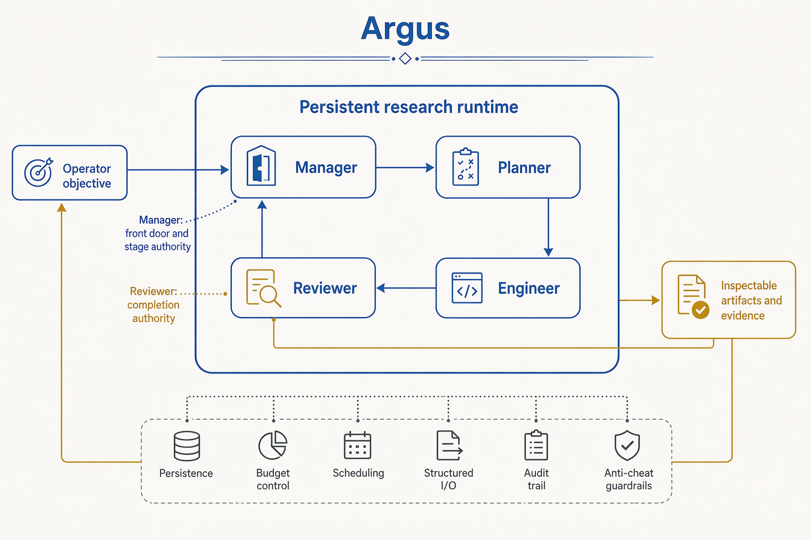

<h1 align="center">Argus: Autonomous Research Generation and Understanding System</h1>

<p align="center"><strong>English</strong> · <a href="README.zh-CN.md">简体中文</a></p>

<p align="center">
  <strong>Persistent research infrastructure for planning, executing, validating, and operating long-horizon empirical programs.</strong>
</p>

<p align="center">
  
</p>

## Overview

Argus is an autonomous-research runtime designed to turn a high-level objective
into a sustained program of literature study, implementation, experimentation,
evaluation, and technical communication. It operates continuously, uses real
tools and hardware, persists state across process restarts, and exposes its work
through an inspectable operator cockpit.

The system is built around four role-specific agents. A **Manager** interprets
operator intent and owns lifecycle transitions; a **Planner** organizes the next
units of work; an **Engineer** performs experiments and produces artifacts; and
a **Reviewer** evaluates evidence and is the sole authority on whether a mission
is complete. The runtime provides scheduling, state management, resource
governance, fault recovery, and evidence provenance without attempting to make
the scientific decisions assigned to those roles.

The primary operating mode is benchmark-driven empirical research across
verticals such as KernelBench, nanochat, and nanoGPT speedrun. An optional
`research` vertical extends the same runtime through an idea-to-submission
manuscript workflow. Argus does not guarantee state-of-the-art results or paper
acceptance; it provides the infrastructure needed to run, measure, inspect, and
continue difficult research programs over long horizons.

## Public results

Results are published at
[argusbot.cn/results.html](https://argusbot.cn/results.html) and
[argusbot.cn/research.html](https://argusbot.cn/research.html). Human records,
human-authored baselines, and paper-reported best results are the primary
references. The corresponding machine-readable snapshots are committed in
[`technical_report/evidence/website_results.json`](technical_report/evidence/website_results.json)
and
[`technical_report/evidence/paper_inventory.json`](technical_report/evidence/paper_inventory.json).

| Arena | Protocol | Argus result | Primary reference | Evidence tier |
|---|---|---:|---|---|
| NVIDIA SOL-ExecBench | B200 · 101 kernels | Global #6 · 2× #1 · 7 top-3 | Public leaderboard rank | Website snapshot |
| nanochat · B200 | 5 min · 1×B200 · 426 attempts | **0.9636 BPB** | Human SOTA: 0.9646 | Local artifact |
| nanochat · H100 | 5 min · 1×H100 · 37 mechanisms | **0.9855 BPB** | Human SOTA: 0.9879 | Website snapshot |
| nanoGPT speedrun | 8×H100 · N=10 | **79.77 s** | Same-device human #83: 80.18 s | Local artifact |
| AARRI-Bench | 82 research-intern tasks | **63/82 · 76.8%** | Paper-reported best: 68.3% | Website snapshot |
| Arbor · RUC NLPIR | Math-Reasoning Data | **28.0 gap** | Arbor: 20.83 | Website snapshot |

The public research portfolio contains **41 de-duplicated papers across six
programs**: 35 manuscripts and 6 drafts. The programs cover cognitive bias in
LLMs (9), multimodal and vision-language models (16), LLM agent methods (5),
efficiency/compression/decoding (7), world models (2), and state trace and
auditability (2). This is an output inventory, not an acceptance count; Argus
makes no claim that 41 papers have been accepted.

Two arena results currently have in-repository corroboration. The nanoGPT result
is verifier-certified over ten runs (`valid=true`, `p=0.004007`,
`79.77±0.06 s`, `seal=ok`). The nanochat B200 result matches a frozen-scorer,
one-seed artifact with `MEAN_VAL_BPB=0.963634`. The other four rows are public
website snapshots and are labeled accordingly rather than presented as locally
reproduced measurements.

## System architecture

Argus separates the runtime into three cooperating planes:

| Plane | Responsibilities | Principal components |
|---|---|---|
| **Control plane** | Intent interpretation, mission planning, stage transitions, scheduling, budgets, and daemon lifecycle | Manager, Planner, `LifeSupervisor`, backlog, project configuration |
| **Execution plane** | Literature search, code changes, experiments, manuscript work, independent review, and background jobs | Engineer, Reviewer, agent-CLI backends, tool adapters, GPU utilities |
| **Evidence plane** | Durable state, typed events, artifacts, usage accounting, measurement records, and publication provenance | `events.jsonl`, `CHECKPOINT.md`, journal, evidence bundles, figure manifests |

The four roles communicate through explicit interfaces:

| Role | System responsibility | Decision boundary |
|---|---|---|
| **Manager** | Front door for operator requests; selects lifetime and vertical; owns pipeline-stage transitions | Other roles may recommend a stage change but cannot apply it |
| **Planner (L4)** | Builds and revises the work backlog; schedules certification work when required | Produces structured tasks and project-level planning verdicts |
| **Engineer (L1)** | Executes one bounded round of research using real files, tools, searches, and hardware | Produces artifacts and a concrete continuation request |
| **Reviewer (L2)** | Inspects artifacts and logs against the active checklist | Returns `done`, `continue`, or `blocked`; completion has no second authority |

An optional Curator maintains shared skill collections in team/subagent modes.
The historical L3 critic layer has been removed; acceptance is consolidated in
the Reviewer rather than duplicated across overlapping evaluators.

## Mission runtime and state

A mission moves through a durable lifecycle: an operator request is interpreted,
planned into backlog items, atomically claimed, executed through
Engineer–Reviewer rounds, and returned as complete, blocked, paused, or ready for
additional planning. The daemon can resume the same campaign after a controlled
restart only when its persisted identity matches the current objective,
vertical, and lineage.

Mission-relevant state is stored outside provider conversations. The append-only
event tape is the canonical timeline; backlog, journal, daemon status, project
configuration, and artifacts provide inspectable working state. Engineer and
Reviewer maintain separate resumable provider sessions for short-window context
reuse. By default, each role's thread is rolled after three rounds or when the
preceding call reports at least 1.5 million input tokens. A curated
`CHECKPOINT.md` carries current goals, verified work, failed approaches,
blockers, evidence, and the next action across those rolls.

The skill system distills reusable procedures from completed work and stores
them in project or shared layers. Skills are versioned and can be updated,
split, merged, archived, or retired based on later evidence. A separate
evidence-cited wiki preserves stable knowledge without turning the event stream
into an unbounded prompt.

## Reliability and resource governance

Long-running research fails as often from execution drift as from weak ideas.
Argus therefore treats recovery and observability as runtime concerns:

- Reviewer decisions classify each round as `decision`, `evidence`,
  `setup_only`, `artifact_sync_only`, or `none`. Two consecutive nondecision
  rounds end the current mission rather than allowing a busy loop to continue.
- A 1,800-second decision-progress budget is enforced only at a safe round
  boundary. Background jobs under independent supervision pause this clock.
- Effective-progress and runner-idle limits detect an unresponsive subprocess;
  backend failures use bounded retry and backoff rather than being converted
  into a successful-looking result.
- Supervised background jobs persist their own status and monitoring cadence, so
  multi-hour training or evaluation can continue without repeated foreground
  polling.
- Per-mission, daily, provider-call, and host-concurrency budgets are reserved
  before execution and reconciled from reported usage afterward.
- Credentials are redacted before events and newly written text artifacts enter
  downstream review or persistent logs.

These mechanisms control execution; they do not score novelty, choose research
ideas, or infer completion from keywords. Scientific quality remains a
structured agent decision grounded in the artifacts of the run.

## Measurement and evidence

Benchmark claims are treated as protocol-scoped measurements. Each program is
expected to retain the benchmark version, hardware and software environment,
baseline definition, commands, exit status, repeated-run statistics where
applicable, and hashes of the artifacts used to support the claim. Evaluation
inputs may be randomized when a fixed known input distribution would permit
hard-coded optimization. Negative results and formal NO-GO decisions are valid
research outcomes when their evidence is reproducible.

The event catalog currently spans 112 event types in 11 categories with 75
payload schemas. The same typed stream powers live cockpit updates and later
audit, so the operator can move from a published number to its mission, round,
review verdict, command record, and artifact set without relying on a prose
summary alone.

## Operator workbench and deployment

The TUI and Web cockpit are operational views over the same persisted project
state. They expose role activity, backlog state, the current stage, budget
consumption, recent events, unresolved operator questions, and links to the
artifacts produced by each round. Live updates and retrospective inspection use
the same event records, which prevents the UI from becoming a separate source of
truth. Operators can submit work, answer a blocking question, inspect a
transcript, nudge or abort a mission, and drain a daemon at a clean mission
boundary.

Argus can run interactively, as a detached project daemon, or under a user-level
service manager for persistent operation. Controlled replacement preserves the
campaign identity and resumes only from compatible state; it does not silently
re-plan an active objective during an upgrade. The Web command surface and live
stream are authenticated when a token is configured, while routine project
inspection remains available through read endpoints. Provider credentials and
machine policy stay in local configuration rather than being copied into
research artifacts.

## Quick start

Argus requires Python 3.11 or newer and one supported agent CLI.

```bash
git clone https://github.com/lbx154/argus-skill.git
cd argus-skill
python -m venv .venv
. .venv/bin/activate
pip install -e .
argus-skill --setup
```

Before starting a daemon, configure at least one trusted machine-policy prompt:

```bash
mkdir -p ~/.argus-skill/special_prompts
printf 'Operational policy for this machine.\n' \
  > ~/.argus-skill/special_prompts/10-machine-policy.md
chmod 0644 ~/.argus-skill/special_prompts/10-machine-policy.md
```

Start a continuous project from its working directory:

```bash
mkdir -p ~/research/world-models
cd ~/research/world-models
argus-skill --daemon --continuous \
  --objective "World Model for Agent Action Selection"
```

Use `argus` for the interactive TUI cockpit, or inspect a running project with
`argus-skill --status`, `--watch`, and `--follow`.

## Supported backends

| Backend | Configuration value | Installation | Authentication |
|---|---|---|---|
| GitHub Copilot CLI | `copilot` | `npm install -g @github/copilot` (Node.js ≥ 22) | Interactive GitHub device authorization |
| OpenAI Codex CLI | `codex` (default) | `npm install -g @openai/codex` | See [`docs/API_CONFIG.md`](docs/API_CONFIG.md) |
| Claude Code | `claude` | `npm install -g @anthropic-ai/claude-code` | Interactive login |

Set `ARGUS_SKILL_RUNNER_BACKEND`, or change the backend and model from the
cockpit without restarting the project.

## Technical report

The architecture, role interfaces, mission state machine, deployment model,
evidence methodology, six public result arenas, and 41-paper portfolio are
documented in:

**[Argus: Autonomous Research Generation and Understanding System — Technical
Report 0.2](technical_report/argus-technical-report.pdf)**

The LaTeX source is under [`technical_report/`](technical_report/) and rebuilds
with `make -C technical_report clean all`.

## Limitations and project status

Argus is under active development. Research quality remains bounded by the
underlying models, tools, data, and compute. The Reviewer is a single fallible
completion authority, four of the six public arena results do not yet have
in-repository reproduction artifacts, and continuous operation has real compute
and provider cost. Benchmark integrity must be engineered separately for each
evaluation protocol. The current evidence system provides content hashes and
provenance manifests, not cryptographic result signing.

Treat every performance number as a scoped result under its stated protocol,
not as a universal capability guarantee.

## License and provenance

Package metadata declares the project under the MIT license. This repository
builds on:

- [skill-agent](https://github.com/lbx154/skill-agent) for skill matching and
  distillation;
- [ArgusBot](https://github.com/waltstephen/ArgusBot) for the reviewer loop and
  CLI runner, with vendored provenance and license material under
  [`argus_skill/agent_cli/`](argus_skill/agent_cli/).
