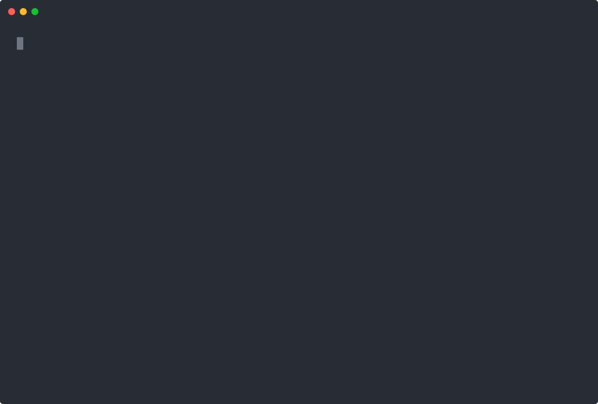

<div align="center">

# argus-skill

**Supervised skill-driven coding agent.**

A merge of [skill-agent](https://github.com/lbx154/skill-agent)'s *horizontal*
skill reuse and [ArgusBot](../ArgusBot)'s *vertical* reviewer-loop supervision.

```text
 █████╗ ██████╗  ██████╗ ██╗   ██╗███████╗      ███████╗██╗  ██╗██╗██╗     ██╗
██╔══██╗██╔══██╗██╔════╝ ██║   ██║██╔════╝      ██╔════╝██║ ██╔╝██║██║     ██║
███████║██████╔╝██║  ███╗██║   ██║███████╗█████╗███████╗█████╔╝ ██║██║     ██║
██╔══██║██╔══██╗██║   ██║██║   ██║╚════██║╚════╝╚════██║██╔═██╗ ██║██║     ██║
██║  ██║██║  ██║╚██████╔╝╚██████╔╝███████║      ███████║██║  ██╗██║███████╗███████╗
╚═╝  ╚═╝╚═╝  ╚═╝ ╚═════╝  ╚═════╝ ╚══════╝      ╚══════╝╚═╝  ╚═╝╚═╝╚══════╝╚══════╝
```

<p></p>

<sub>Replay on your own terminal: <code>asciinema play docs/demo.cast</code></sub>

</div>

## What it is

argus-skill runs a coding task through this pipeline:

```
task → skill matcher → distill new skill if no high-fit match
     ↓
     supervised engineer round-loop
       round k: engineer turn → user-provided checks → reviewer
         done    → write skill back, return success
         continue → inject reviewer.next_action, next round
         blocked  → stop with reason
```

* **Horizontal layer** (from skill-agent): every task seeds a markdown
  *capability skill* in `skills/`. Future similar tasks reuse the same
  skill at near-zero cost. The matcher is fit-graded — only `high`-fit
  skills are applied, so the wrong skill cannot drag the engineer into a
  sibling sub-domain.

* **Vertical layer** (from ArgusBot): the engineer doesn't ship as a
  one-shot. A reviewer sub-agent reads the engineer's output plus the
  user's acceptance checks (`pytest -q`, `make test`, etc.) and emits a
  structured `{done, continue, blocked}` verdict. On `continue` the
  reviewer's `next_action` is fed back into the next engineer round.

These two layers are orthogonal and multiplicative: the matcher cuts the
search-space cost; the reviewer-loop cuts the failure cost.

## Quick demo (no LLM required)

The repo ships an in-memory deterministic backend that scripts canned
responses, so you can smoke-test the whole loop end-to-end without an
API key:

```bash
pip install -e .

# Single 7×24 entry — drops you into the REPL cockpit.
# A background daemon is auto-spawned; the iteration loop is on.
ARGUS_SKILL_LIFE_BACKEND=memory argus-skill
```

Add `--no-daemon` if you only want the REPL smoke and do not want the
background worker to auto-spawn.

In the REPL, free text becomes a mission immediately. Slash commands
manage the state — `/help` lists them all. The cockpit shows live
daemon health, backlog count, and the iteration banner so you know
the agent will keep polishing the artefact after the first
"reviewer says done":

```text
argus › ship me a base64 helper
▶ mission start — ship me a base64 helper
🔁 engineer round 1   …   🧑‍⚖️ review: done (conf=0.94)
🔁 critic verdict: continue — missing url-safe variant
🔁 engineer round 1   …   🧑‍⚖️ review: done (conf=0.97)
🔁 critic verdict: stop — objective fully satisfied
■ mission complete  ·  iter=1/3  ·  cost=$0.0042
```

To skip the polish pass on a single item: `/add --once <objective>`.

## Real usage (with codex / claude-code)

Drive a real CLI by setting the env vars and running the unified entry
point. The REPL handles the rest — auto-spawning the daemon,
distilling skills, supervising the engineer, and iterating on the
artefact until the critic stops.

### Option A — `ARGUS_SKILL_LIFE_BACKEND=codex` (zero code)

The CLI ships a `CodexRunnerBackend` adapter that wraps ArgusBot's
battle-tested `codex_autoloop.codex_runner.CodexRunner`. Set the env
vars and run:

```bash
ARGUS_SKILL_LIFE_BACKEND=codex \
ARGUS_SKILL_RUNNER_BIN=$(which codex) \
argus-skill
```

Inside the REPL, type the task. The same supervisor that drives the
in-memory demo now talks to your real `codex` CLI.

Honoured env vars:

| Variable | Meaning | Default |
|----------|---------|---------|
| `ARGUS_SKILL_LIFE_BACKEND` | daemon backend: `memory` (stub) or `codex` (real CLI) | `codex` |
| `ARGUS_SKILL_RUNNER_BACKEND` | subprocess backend: `codex` / `claude` / `copilot` | `codex` |
| `ARGUS_SKILL_RUNNER_BIN` | path to the CLI binary used by the runner adapter | resolved on `$PATH` |
| `ARGUS_SKILL_RUNNER_EXTRA_ARGS` | shell-quoted args appended to every runner call | empty |
| `ARGUS_SKILL_TELEGRAM_BOT_TOKEN` | optional Telegram bot token for inbound control | unset |
| `ARGUS_SKILL_TELEGRAM_CHAT_ID` | Telegram chat id accepted by the poller | unset |
| `ARGUS_SKILL_TELEGRAM_USER_ID` | optional Telegram sender id filter | unset |

Requires ArgusBot to be importable (`pip install -e ../ArgusBot`).

`memory` is the deterministic smoke backend; it can run single-shot
missions, but continuous mode requires the planning-capable `codex`
backend.

Continuous mode is validated up front: `--objective` must be paired
with `--continuous`, `--continuous` requires a non-empty objective, and
`memory` cannot enter planner mode.

### Telegram bridge (optional)

If `ARGUS_SKILL_TELEGRAM_BOT_TOKEN` and `ARGUS_SKILL_TELEGRAM_CHAT_ID`
are set, the daemon starts a long-polling Telegram command bridge.
`ARGUS_SKILL_TELEGRAM_USER_ID` is optional; when present, only that
Telegram sender is accepted.

Supported inbound commands:

* `/add <title>: <objective>` - add a backlog item.
* `/status` - report daemon, backlog, cost, and continuous state.
* `/backlog` - list pending tasks.
* `/start [objective]` - enable continuous mode.
* `/stop` - disable continuous mode.
* `/nudge <text>` - inject operator guidance into the next round.
* `/help` - show the command list.

`/start` follows the same guardrails as the CLI: the objective must be
non-empty, and the `memory` backend cannot plan.

### Option B — custom backend (full control)

For non-codex / non-claude CLIs, import `SkillLoop` from your own
driver script and pass a `RunnerBackend` that wraps your CLI:

```python
from pathlib import Path
from argus_skill import SkillLoop, SkillLoopConfig
from argus_skill.core.ports import RunnerBackend
from argus_skill.core.models import RunnerOptions, RunnerResult

class CodexBackend:
    """Wrap subprocess `codex exec` here. Implement run_exec(...)."""
    def run_exec(self, *, prompt, options: RunnerOptions, run_label,
                 resume_thread_id=None) -> RunnerResult:
        ...  # call your CLI, parse stdout, return RunnerResult

backend = CodexBackend()
loop = SkillLoop(
    skills_dir=Path("skills"),
    scientist_runner=backend,
    engineer_runner=backend,
    reviewer_runner=backend,   # can be a cheaper model
    config=SkillLoopConfig(
        scientist_model="gpt-5.4",
        engineer_model="gpt-5.4-mini",
        reviewer_model="gpt-5.4-mini",
        max_rounds=3,
        check_commands=["pytest -q"],
    ),
)

outcome = loop.run("fix the failing tests in src/foo/")
print(outcome.status, outcome.round_count, outcome.skill_used)
```

The same `RunnerBackend` interface works for codex, claude-code, copilot
CLI, or anything else — only the wrapper changes.

## Run as a 7×24 lifetime agent

`argus-skill` (with no subcommand) drops into the **unified REPL**: a
single foreground process that owns the supervisor, the per-project
backlog, the journal, the layered skill cache, and the reviewer
calibration log. Free text becomes a mission immediately; slash
commands manage the state. The older one-shot modes are historical and
no longer part of the live interface.

```bash
ARGUS_SKILL_LIFE_BACKEND=codex argus-skill
```

```text
argus › fix the failing tests in src/foo/
▶ mission start — fix the failing tests in src/foo/
🔧 round 1: main agent finished
🧑‍⚖️ round 1: review • done@0.92
■ mission complete  ·  status=success  ·  rounds=1  ·  cost=$0.0012

argus › /journal 5             # tail recent journal entries
argus › /backlog               # see what's queued (other terminals can /add)
argus › /skills ls             # global skill library
argus › /skills promote my-fix # move a project skill to global
argus › /correct <mid> disagree "missed the null-path edge case"
argus › /exit                  # bye
```

The persistent state lives under `~/.argus-skill/`:

| Path | Scope |
| --- | --- |
| `identity.md`, `journal.jsonl` | global (cross-project) |
| `skills/` | global skill library |
| `skills/_archive/` | retired skills |
| `reviewer/lessons.jsonl` | reviewer calibration (`/correct` writes here) |
| `projects/<fingerprint>/project.md` | per-project card |
| `projects/<fingerprint>/memory.jsonl` | per-project memory journal |
| `projects/<fingerprint>/backlog.jsonl` | per-project backlog |
| `projects/<fingerprint>/continuous.json` | per-project continuous-mode state |
| `projects/<fingerprint>/events.jsonl` | per-project event log / watch feed |
| `projects/<fingerprint>/inbox.jsonl` | per-project operator nudge queue |
| `projects/<fingerprint>/daemon.pid` / `daemon.status.json` / `repl.pid` | per-project process state |
| `projects/<fingerprint>/skills/` | per-project skill cache |
| `projects/<fingerprint>/missions/` | per-project mission records |

Run `argus-skill --status` to inspect the current project backlog, the
project-local daemon state, and the shared global journal without
entering the REPL.

### Background daemon (real 7×24)

The REPL is the cockpit; the daemon is the engine room. Running
`argus-skill --daemon` spawns a detached background worker that drains
your backlog forever — even after you close the terminal, log out, or
the REPL exits.

```bash
argus-skill --daemon          # detach a worker, returns immediately
argus-skill --status          # one-shot status (daemon/backlog/continuous)
argus-skill --daemon-stop     # graceful SIGTERM
argus-skill --daemon-fg       # run in the foreground (for systemd / debugging)
```

The daemon and the REPL coexist safely:

* They use **separate PID locks** (`<state>/repl.pid` vs
  `<state>/daemon.pid`) — neither blocks the other.
* They share the **same atomic state machine**: every mission goes
  through `Backlog.claim_next()` (an atomic `pending → running` CAS on
  the JSONL file). Two workers cannot pick the same mission, even
  under contention.
* They share the **same continuous-state file** (`continuous.json`):
  `argus-skill --status` reports whether continuous mode is enabled,
  which objective is active, and any recorded `done_reason` / `done_at`.
* If a worker dies hard, the next process startup reaps any stuck
  `running` items and marks them `failed` — re-execution is impossible
  because terminal states are sealed (`IllegalStateTransition`).

When the REPL launches with a live daemon, the banner says so:

```text
mode    → life  ⚡ daemon: pid 12345 · up 4h 12m
backend → codex   (/backend memory|codex)
```

### Will the daemon survive when I close the terminal / disconnect SSH / sleep?

Yes — by design, with one OS-level caveat to know about.

The detach mechanism: `argus-skill --daemon` (or the auto-spawn when
the REPL launches) does **POSIX double-fork + `setsid` + `chdir("/")`
+ stdio → log file + SIGHUP ignored**. After the spawn:

* `PPID = 1` (init / systemd) — the daemon is fully reparented.
* It lives in **its own session**; closing the terminal or
  disconnecting SSH cannot deliver SIGHUP to it.
* `argus-skill --status` reports `survival : linger=on` when your
  Linux user has logout-survival enabled.

What can still kill it:

1. **`systemd-logind KillUserProcesses=yes`** (default on some
   distros) — kills *all* processes owned by your user when you log
   out, regardless of session. Fix once per user:

   ```bash
   loginctl enable-linger $USER
   ```

   `argus-skill --status` warns when linger is off.

2. **The machine itself sleeps** — laptop closes lid, OS suspends
   CPU, the daemon (and codex) pause until wake. For real 7×24 run
   on a server, a desktop with sleep disabled, or a cloud VM.

3. **`pkill python` or similar broad kills** — operator error, no
   software can defend against this.

For the strictest guarantee, run under systemd as a user service so
restart-on-crash + boot-on-reboot are handled by the OS — see
[Running under systemd](#running-under-systemd) below.

A typical workflow: leave the daemon running on a small server, drop
into the REPL from your laptop to inspect / `/add` / `/correct`, walk
away. The daemon keeps draining.

### Running under systemd

```ini
# /etc/systemd/system/argus-skill.service
[Unit]
Description=argus-skill 7×24 lifetime agent
After=network.target

[Service]
Type=simple
User=ops
Environment=ARGUS_SKILL_LIFE_BACKEND=codex
Environment=ARGUS_SKILL_RUNNER_BIN=/usr/local/bin/codex
Environment=ARGUS_SKILL_PER_MISSION_CAP_USD=1.0
Environment=ARGUS_SKILL_DAILY_CAP_USD=10.0
ExecStart=/usr/local/bin/argus-skill --daemon-fg
Restart=on-failure
RestartSec=5

[Install]
WantedBy=multi-user.target
```

`--daemon-fg` keeps the worker in the foreground and lets systemd own
the process lifecycle (restart, logging, stop). Use `--daemon` only for
ad-hoc detach in interactive sessions.

If you are about to upgrade the code while the daemon is the thing
keeping your current session alive, run `argus-skill --daemon-runbook`
from a separate shell first. It prints the safe sequence: checkpoint,
stop from the outside, update, relaunch, verify.

## Architecture at a glance

```
argus_skill/
├── core/
│   ├── models.py        # CheckResult, ReviewDecision, RunnerOptions, RunnerResult, LoopOutcome
│   ├── ports.py         # RunnerBackend, SkillSource, ControlChannel, EventSink protocols
│   └── project.py       # cwd → project fingerprinting
├── scientist/
│   ├── prompts.py       # vendored from skill-agent (Coverage check + When NOT to use + fit-graded matcher)
│   └── distiller.py     # calls runner with Prompts.distill(...)
├── skills/
│   ├── layered.py
│   ├── lifecycle.py
│   ├── quality.py
│   └── store.py         # vendored from skill-agent (markdown cache + fit-graded matcher)
├── engineer/
│   ├── reviewer.py      # vendored from ArgusBot (refactored to take RunnerBackend protocol)
│   ├── reviewer_schema.json
│   ├── checks.py        # vendored from ArgusBot
│   └── runner.py        # SupervisedEngineer: round-loop control flow (NEW)
├── adapters/
│   ├── memory_backend.py  # deterministic stub for tests / smoke runs (NEW)
│   ├── codex_backend.py   # CodexRunnerBackend — wraps ArgusBot's CodexRunner (NEW)
│   └── stream_progress.py # shared live-output plumbing for runner events
├── critic/
│   └── critic.py         # critic + planner logic for iteration / continuous mode
├── daemon/
│   ├── token_lock.py    # vendored verbatim from ArgusBot (single-process token guard)
│   └── life_worker.py   # 7×24 background worker around LifeSupervisor (NEW)
├── apps/
│   ├── cli.py           # `argus-skill` entry point, one-shot actions, REPL fallback
│   ├── _life_repl.py    # the unified REPL surface
│   ├── _skill_stats.py
│   ├── _skill_cleanse.py
│   ├── _watch.py
│   ├── _init_identity.py
│   └── _input_helpers.py
├── cli/
│   ├── branding.py
│   ├── event_format.py
│   ├── render.py
│   └── theme.py
├── life/
│   ├── event_log.py
│   ├── memory.py
│   ├── telegram_bot.py  # optional Telegram inbound command bridge
│   ├── notify.py
│   ├── router.py
│   └── supervisor.py
└── loop.py              # SkillLoop — the matcher × distiller × supervised-engineer GLUE
```

See [docs/ARCHITECTURE.md](docs/ARCHITECTURE.md) for a per-file
provenance map ("which file came from which upstream").

**Related docs** (added 2026-05-10 after the v12 retrospective):

- [docs/PRICING.md](docs/PRICING.md) — canonical OpenAI model pricing & cache-discount math. Read before computing any cost.
- [docs/EXPERIMENT_PROTOCOL.md](docs/EXPERIMENT_PROTOCOL.md) — mandatory pre-run / post-run checklist for any experiment. Designed so a months-later forensic on tonight's data won't require archaeology.
- [docs/RETROSPECTIVE-v12-vs-current.md](docs/RETROSPECTIVE-v12-vs-current.md) — why the 2026-05-06 v12 fullbench hit 0.596 reward at $0.14/trial (≈ 42% of codex-bare large baseline) while the current v4-pri-2 ablation is misleadingly cheap because it disabled the components that did the work.
- [benchmarks/reports/2026-05-10-tb2-baseline-vs-v12.md](benchmarks/reports/2026-05-10-tb2-baseline-vs-v12.md) — full head-to-head comparison of v12 against bare-large (`gpt-5.4`) and bare-mini (`gpt-5.4-mini`) baselines on TB v2's same 89-task dataset commit. Includes pairwise win/loss diff and corrected cost reconstruction.

## Tests

```bash
pip install -e ".[dev]"
pytest -q
```

The default suite runs in <1s and uses only the in-memory backend. The
end-to-end smoke test (`tests/test_loop_smoke.py`) exercises:

* matcher miss → distill → 2 rounds (continue → done) → skill writeback
* second-run cache hit (matcher returns high-fit, no redistill)
* reviewer says blocked → loop short-circuits in 1 round
* every round says continue → loop hits `max_rounds` cleanly
* `--no-distill-on-miss` falls back to running engineer skill-less

## Status

v0.1. End-to-end working with two backends:

* `ARGUS_SKILL_LIFE_BACKEND=memory` — deterministic in-process stub used
  by the test suite, demos, and CI. No API key required.
* `ARGUS_SKILL_LIFE_BACKEND=codex` (default) — drives a real codex CLI
  through `CodexRunnerBackend`. Requires a working `codex` binary on
  `$PATH`.

The unified REPL is the primary entry point. Historical one-shot modes
were removed during the consolidation into `apps/cli.py` and
`apps/_life_repl.py`. The detached daemon and Telegram poller share the
same split memory state: global identity/journal live at the shared
root, while backlog, project memory, events, and process locks live
under `projects/<fingerprint>/`. Cross-process safety is provided by a
per-project singleton lock (`projects/<fingerprint>/repl.pid`) and a
state-machine seal that makes terminal backlog items unrunnable.

## License

MIT — see [LICENSE](LICENSE).

## Provenance

* [skill-agent](https://github.com/lbx154/skill-agent) (Phase A as of
  2026-05-03): the `skill_store.py`, `prompts.py`, and the
  Coverage / When NOT to use / fit-graded matcher prompt engineering.
* [ArgusBot](../ArgusBot): the `reviewer.py`, `reviewer_schema.json`,
  `checks.py`, and the LoopEngine round-loop control flow.
* New code in argus-skill: `core/models.py`, `core/ports.py`,
  `engineer/runner.py` (SupervisedEngineer), `loop.py` (SkillLoop), the
  in-memory backend, the CLI, the tests.
