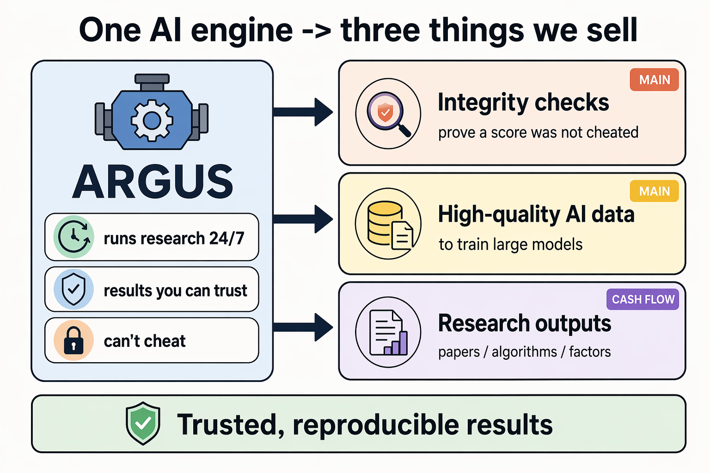
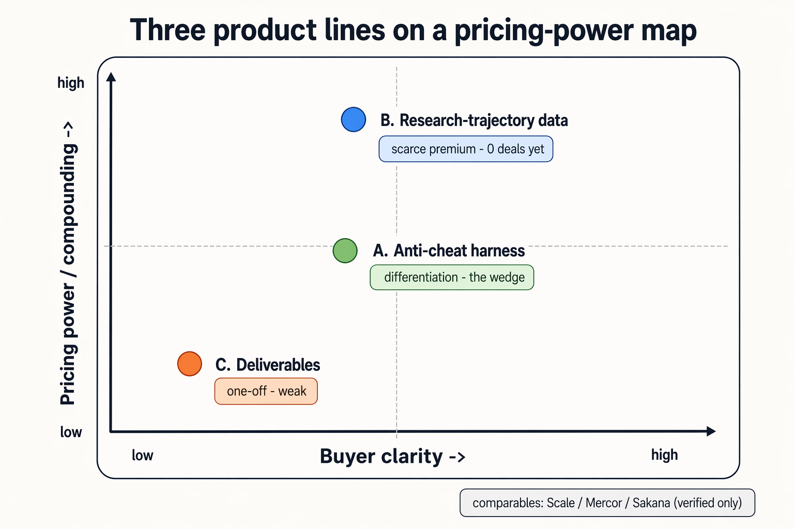
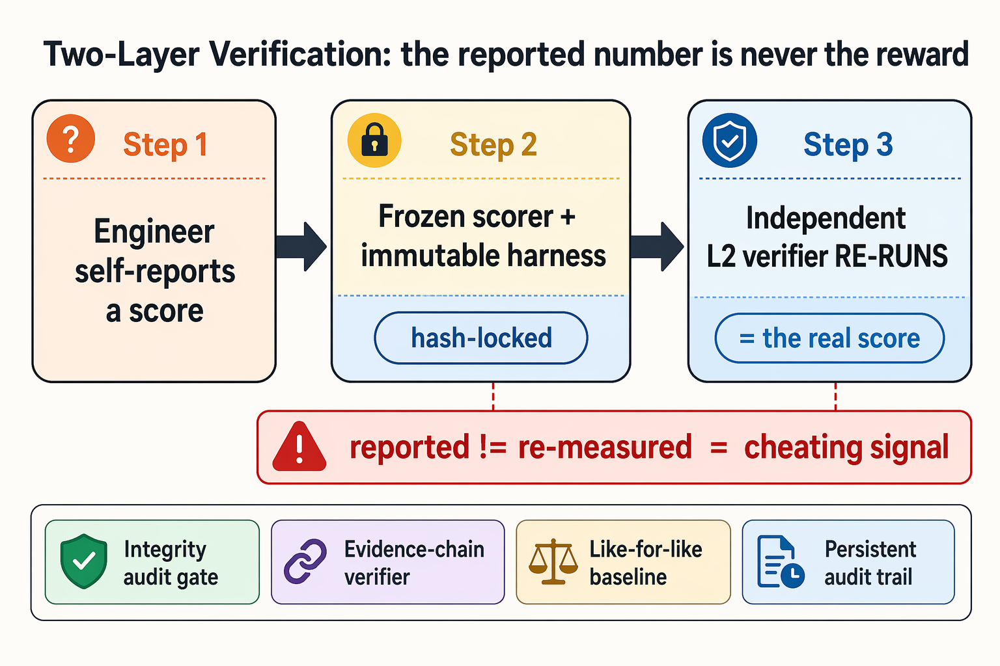
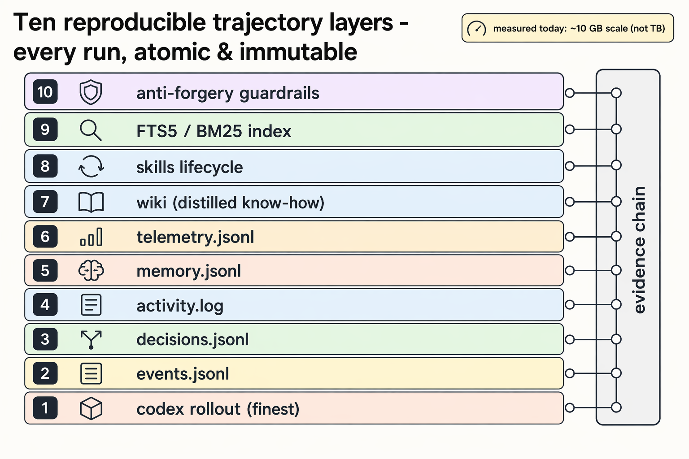
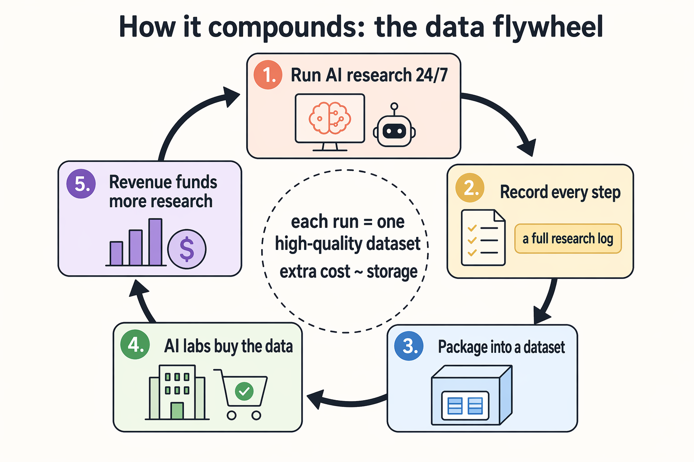
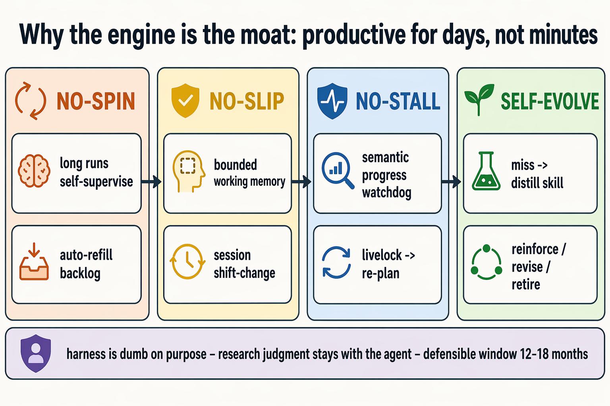
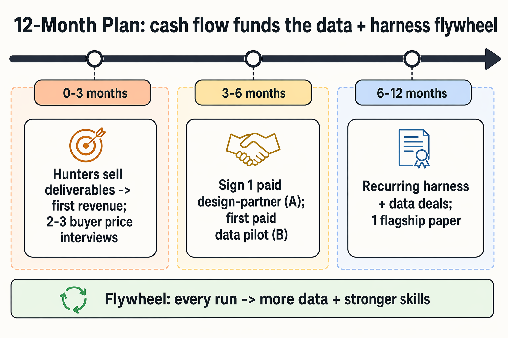

# Argus 商业计划书

> 一个 7×24 全自主、绝不报喜报早的 research agent —— 以及它在跑研究的过程中,顺手沉淀下来的两类副产品资产。

> **诚实声明(全文适用):** Argus 今天是一套**"有监督但自主"的研究系统**,不是已经打磨好的商业产品。本文里所有的 harness(反作弊)能力和数据资产都是**跑研究时沉淀下来的副产品**,要变成可售产品仍有明确的工程量。**本公司当前 pre-revenue:0 付费客户、0 LOI、0 已签 design-partner、0 买家价格访谈。** 下文每一节都会显式区分 **【今天已有】(有代码、有真机在跑)** 与 **【要做成产品还差】**。所有市场数字与对标公司均标注置信度;凡 `unverified` 的口头线索一律按"线索"而非"事实"处理,不编造客户名与合同额,也不作为对外承诺或 why-now 主论证。

---

## 1. 执行摘要(一页)



*图 1 · Argus「一跑三产物」:一个引擎,三条产品线。成品(C)最不易变现 → 现金流地板;反作弊 harness(A)与研究轨迹数据(B)才是高议价的副产品杠杆。*


> **牵引现状(放在最前,避免飞轮图造成"已运转"错觉):** 今天我们有一个**在真机上连续运行、能自主产出可复现研究结论的引擎**,但**商业侧尚未经过任何市场验证**——没有付费客户、没有 LOI、没有在谈的 design-partner(仅有 unverified 内部线索)、没有买家给过价格。本 BP 是一个**pre-revenue、pre-PMF** 的种子故事:卖的是"引擎 + 两类副产品资产 + 一支要补齐的团队",不是已验证的收入曲线。

**Argus 是什么。** Argus 是一个完全独立于人、7×24 自己做科研的 research agent(repo `github.com/lbx154/argus-skill`,MIT)。给它一个"研究目标 + 机器规则",它自己选题→调研→设计实验→在**真实公开 benchmark 上真实测量**→分析→写代码→产出可复现结论,没有人在回路里逐步审批。底层是三层 agent(基于 OpenAI Codex CLI,**当前默认 gpt-5.5**,见 `loop.py:54-55`、`life/supervisor/_core.py:207-208`、`daemon/life_worker.py:85-87`):**Planner(L4 规划)/ Engineer(L1 工程)/ Reviewer(L2 审稿,是"任务完成与否"的唯一事实来源)**,外挂并行 subagent 池。

**它真实跑过什么(用可核实的运行体量代替"文件数"虚荣指标):**
- 在**三类真机公开 benchmark** 上连续运行:CUDA kernel 优化(KernelBench / B200)、训练脚本提速(nanoGPT speedrun / 8×H100)、训练效果优化(nanochat / B200);另有量化因子挖掘、自动写论文垂类。
- 已沉淀 **24,025 条 codex rollout 轨迹**(每次 LLM 调用的完整 tool_call/输出/上下文)、**404 条独立 mission 级审计链**(`events.jsonl`)。这些是落盘可数的真实运行痕迹,不是 PPT；旧的 `memory.jsonl` 旁路已合并进 `events.jsonl`。

**核心洞察(也是本 BP 的论点):** Argus 跑出来的**成品**(论文 / kernel / 因子)是三类资产里**最不容易变现**的一类;更有价值的是它为了"绝不作弊"而被迫造出来的两样**副产品**——

1. **一整套反作弊 / 完整性 harness**(真实公开 benchmark、环境严格对齐、全规模证据门、独立验证器重测、可复现审计链);其中"评测输入随机化"这一抗硬编码属性**继承自公开 KernelBench 评分器**(第三方),**Argus 自有的输入随机注入尚未实现(待建)**——这一点下文如实标注,不算作我们已落地的机制。
2. **每个 run 沉淀的完整高质量研究轨迹数据**(选题→调研→实验→真实测量→分析→代码→结论,外加蒸馏 skill、idea wiki、决策审计链,带可复现的证据链)。

加上让它们成立的**引擎本身**(长跑数天不退化:不空转、不打滑、不卡死 + 自进化)——这才是当前的工程壁垒(为何是"领先而非不可复制",见 §5.4)。

**三条产品线(按真实优先级):**

| 优先级 | 产品线 | 卖什么 | 本质 | 议价权 |
|---|---|---|---|---|
| **主攻 A** | 反作弊 / 完整性 harness 即服务 | 给做数据集评测 / 模型基准 / RL environment 的公司,卖"防作弊、可审计"的护栏 | 副产品产品化 | 中(差异化卖点) |
| **主攻 B(创始人最看好)** | 高质量研究轨迹数据 | 给训基模的前沿实验室,卖"带可复现审计链的 agentic / reasoning 轨迹语料" | 副产品产品化 | 中高(稀缺品类,但 0 成交价) |
| **兜底 C** | 研究成品(论文 / kernel / 因子) | 横向 Hunters 把成品卖出去,做现金流 | 成品交付 | **弱(一次性、买家不清晰)** |

**Why now(只用可公开核实的结构性力量,把未证实采购传闻排除在主论证之外):** RL environment / 评测完整性 / 专家级训练数据,正好是 2025–2026 最热的 AI 基建缺口(Anthropic 据报讨论未来一年在 RL environments 上花 >10 亿美元 [medium];benchmark 污染与刷榜成为公开丑闻 [high];数据墙逼前沿实验室高价抢专家轨迹 [high])。Argus 不是去新造需求,是把已有的强需求用"可复现、可审计"的招牌去接。**(字节 Seed 采购窗口、周老师-Seed 关系等仅为 unverified 内部线索,见 §4.2 / §8,不进 why-now 主论证。)**

**The Ask(粗口径):** 寻求 **种子轮约 4–6M 美元**(对标:Standard Kernel 种子 $20M、Mechanize 种子 $9.1M、Prime Intellect $15M,均 [high/medium]),换 18 个月跑道,把今天的**引擎**产品化为 A、B 两条可售产品线,同时用 C 线横向团队跑现金流,并**补齐商业化 / GTM 团队**(见 §4.2)。资金主要投向:数据脱敏 / schema / 清洗管线、harness 的 API 解耦与独立第三方化、2–3 名横向 Hunters 销售、IP / 法务合规、B200/H100 算力。**具体数字是粗口径,锚定里程碑分阶段释放(见 §7)。**

---

## 2. Why now / 为什么是现在(时间窗)

三股**可公开核实**的结构性力量同时打开了一个窗口,而 Argus 的副产品正好长在窗口正中央。

**(1) 训练重心从"静态数据集"转向"交互式 RL environment + 显式推理轨迹"。**
前沿实验室把钱砸向"环境 + 评测 + 专家过程数据":TechCrunch(2025-09)报道 Anthropic 内部讨论未来一年在 RL environments 上投 **>10 亿美元** [medium];一批公司专做这件事并拿到大钱——Mechanize(种子 $9.1M)、Prime Intellect($15M,做"RL 环境界的 Hugging Face")、Surge(年收入 >$1B)、Mercor(~$10B 估值 / ~$500M ARR)、Scale(Meta $14.3B 投资 / ~$29B 估值)[funding 多为 high/medium]。**Argus 的反作弊 harness(A)和研究轨迹(B)正是这条赛道的两个核心投入品。**

**(2) benchmark 污染与刷榜成了公开的信任危机。**
FrontierMath 私有 holdout 审计争议、LMArena "Leaderboard Illusion" 刷榜指控(LMArena 仍拿到 $1.5 亿 A 轮 / ~$17 亿估值 [high])、benchmark 污染论文成堆、reward-hacking 成为 agent 训练一线工程难题。"可证明抗污染、可审计、防 reward hack"从"加分项"变成"采购前提"——这正是 Argus 出厂自带的方向。

**(3) 数据墙 + 合成数据冲击,把价值挤到"高端专家 / agentic 轨迹"这一侧。**
高质量公开文本接近枯竭;后训练 / RLHF / CoT 需要大量专家手写推理链(前沿实验室公开给 PhD 专家开 **$70–200/hr** [Terac/Mercor,medium–high])。合成数据的真实共识是**"混合、增强,而非替代"**——它压低端众包的价、抬高端专家 / agentic 轨迹的价。Argus 站在被抬价的一侧:它天然产出"长程、多工具、可复现、带审计链"的研究轨迹,正是 Labelbox 专门开 agentic-trajectory 产品线、学界涌现 ASTRA 等自动轨迹合成论文所抢的稀缺缺口。

> 一句话:别人在为"防作弊"和"高质量轨迹"重金自建或外采,而 Argus 为了诚实地做研究,已经把这两样东西的雏形造出来并在真机上验证过了。**但"窗口正开"不等于"我们已接到单"——当前 0 付费验证,见 §1 牵引现状与 §8。**

---

## 3. What / 我们卖什么(三条产品线)



*图 2 · 三条产品线的议价权地图:B 稀缺溢价但 0 成交、A 差异化、C 一次性议价弱;对标仅列可核实公司(Scale / Mercor / Sakana)。*


### 3.A 主攻 A —— 反作弊 / 完整性 harness 即服务



*图 3 · 两层验证:工程师自报的数字永远不是奖励;独立 L2 验证器用冻结 harness 重测,「报告 ≠ 重测」即作弊信号。注:抗硬编码的输入随机化继承自第三方公开评测器,Argus 自有注入待建——图中不列为已落地机制。*


**它是什么。** 把 Argus 内置的反作弊 / 完整性护栏从框架里抽出来,作为独立服务,卖给**做数据集评测平台、模型基准、RL environment、自动研究系统**的公司,帮他们保证"提交者无法作弊、报告真实可复现"。

**基于 Argus 哪段真实能力(evidence)。** 这不是 PPT,是 Argus 为了堵自己 agent 的 reward hacking 而真实落地的 **8 套机制**,核心是**两层验证:工程师自报 → 独立 L2 评审员用冻结 harness 重新测量**:

| 机制 | 干什么 | 证据(file:line) |
|---|---|---|
| 冻结评分器 & 不可变 harness | 评分合约 / metric / held-out test / 预算被哈希绑定为"冻结",工程师只能改指定工件,改 harness 无效(用原版重跑) | `verticals/speedrun/stages.py:218-232`;`skills/run_contract.py:1-52` |
| 验证器重测防作弊 | "你报告的数字永远不是奖励;奖励是独立验证器重跑测出的数字";报告与重测差异 = 作弊信号 | `builtin_skills/engineer/nanochat-pretrain-runner.md:126-129`;`engineer/reviewer.py:274-276` |
| 完整性审计网关 | 独立交叉模型审计 5 维(ground truth 出处 / 分数自归一化 / 结果文件存在性 / 死代码检测 / 范围注水),输出机器可读 `EXPERIMENT_AUDIT.json` 的 pass/warn/fail | `skills/experiment_audit_gate.py:85-194` |
| 地面真理强制契约 | 任何优化前必须先建经验证的 `GROUND_TRUTH.md`(实测现状,不是假设);评审员亲自重验,不信工程师转述 | `skills/ground_truth.py:25-75`;`engineer/reviewer.py:574-577` |
| 运行合同 + 可行性包 | 全规模 GPU 跑之前锁 LR / steps / 课程哈希,防"plan 漂移"与"课程饱和"烧掉数小时算力才发现 | `skills/run_contract.py`;`skills/stage_checklists.py:220-240` |
| 证据链验证器 | claim → 证据文件 → bundle → BUILD_INFO 全链完整性,断链则 review 失败、稿件无法投递;拒污染 bundle 引用 | `skills/evidence_chain.py:1-120` |
| Like-for-Like 基线重测 | 基线(已发表 SOTA / Recursive reference)必须在同硬件 / 同 harness / 同 protocol 重测,禁止跨硬件比 | `builtin_skills/engineer/nanochat-pretrain-runner.md:100-103` |
| 持久化审计轨迹 | 每个 supervisor 事件扇出写 `events.jsonl`,daemon 重启也存活,完整 token/cost/decision 可回放 | `life/event_log.py`;`life/activity_log.py` |

> **诚实更正(原稿曾把"评测输入随机仿射"列为 Argus 自有第 9 套机制并配 Argus 代码行,撤回):** 全仓 grep `affine/仿射` 仅命中两份**文档措辞**(`docs/Argus_项目介绍.md`、`docs/Argus_一页纸概览.md`),**代码里没有任何输入随机仿射注入逻辑**;原引的 `kernelbench/stages.py:72-188` 实为 `REVIEWER_CHECKLISTS` 文案。真实情况是:**抗硬编码所依赖的输入随机化是公开 KernelBench 评分器自带的属性**(第三方,见 `builtin_skills/engineer/sol-kernel-sota-optimization.md` 中对 scorer randomizes inputs 的引用),Argus 侧目前只是**依赖并校验**该属性。**Argus 自有的随机注入机制属【要做成产品还差】,见下。**

**卖给谁。** 数据集评测平台 / 私有抗污染 benchmark 厂商 / RL environment 厂商 / 做自动研究或自动数据集生成的公司。具体客户画像见 §4。

**对标公司(均为"把抗污染 / 防作弊当差异化卖点"的形态,无一是纯反作弊 SKU):**

| 公司 | 在做什么 | 资金 / 估值 | 置信度 |
|---|---|---|---|
| Scale AI — SEAL | 专家私有集做评测 / 排行榜,卖点就是防污染、防过拟、防刷榜 | Meta $14.3B 投资 / ~$29B 估值 | high |
| Patronus AI | 企业级 LLM 评测 / 监控(幻觉 / PII / 版权) | $17M A 轮 | high |
| Vals AI | 法律 / 金融垂直私有 benchmark,闸门访问降泄露 | 有 A 轮(金额付费墙) | medium |
| Mechanize | 给前沿实验室造高保真 RL environments / evals | 种子 $9.1M / 自称 $500M 投后 | medium |
| Prime Intellect | RL environments 社区 Hub + verifiers 开源 | $15M(2025-02) | high |
| LMArena / FrontierMath / METR | 评测平台 / 私有 holdout / reward-hack 研究——证明"防作弊"是真痛点 | LMArena $150M A / ~$17B | high |

> **从对标矩阵中移除"Unipet":** operator 经港大博士生转述的"反作弊数据集厂商 Unipet",多种拼写均只命中无关对象(PET 影像模型、NLG 评测器、宠物食品公司),**查无实据**。**它不进任何对标表,不写公司名 / 不写"7 个数据集卖给多家公司"这种数字**,仅在 §8 风险段保留一句"市场上可能存在此形态,无实据"。

**定价 / 市场规模(置信度优先于数字):**
- **没有一个干净的"反作弊 harness 独立品类"市场数字可引。** 第三方对"模型评测 / 基准工具"市场 2025 年给出 ~$1.15B(Precedence)/ ~$1.35B(Congruence)/ ~$2.4B(DataIntelo)不等,口径混乱,**均 [low](SEO 报告,非一手)**。
- 更可信的是**相邻品类的一手需求信号**:Anthropic 讨论 RL environments >$10亿/年 [medium]、Surge 年收入 >$10亿 [medium]、Scale ~$29B 估值 [high]。
- **"几千万美元市场"是 operator 的主观估值假设 [unverified],不与上面的相邻市场数字混排造成"有据"错觉。** 它只在"Argus 卖 environment / 评测 / 轨迹数据、用反作弊作为差异化卖点去拿合同"这个形态下有讨论意义(占十亿级相邻市场的个位数百分比即可达成)。**若定位为"纯反作弊工具厂商",这是一个未被验证、可能根本不构成独立可售 SKU 的新品类——本 BP 诚实写明。** 计价上更现实的不是 per-license,而是**评测 / 环境合同里的"完整性溢价"** + 可能的审计 API 调用计费。
- 价格锚点状态:**0 个买家访谈、0 个成交价**——A 线的具体 ACV 区间是 §7.3 里明确标注的占位假设,补齐 2–3 个买家价格对话是 0–3 月首要动作。

**【今天已有】** 8 套机制都有代码、都在真机(kernel / speedrun / nanochat / 论文)上验证过;两层验证(自报 → 独立重测)是真实运行的;审计链 `events.jsonl` daemon 重启也存活。

**【要做成产品还差】**
- **自有输入随机注入**(当前抗硬编码靠公开 scorer 的属性,不是 Argus 自造;要作为卖点须自建并测试);
- 把 prompt / decision logic **从 Argus 特定角色名 / 阶段名 / checkpoint schema 里解耦**;
- 做 **API 契约**让任何 LLM backend(不止 Codex)能 plug in,加 web/CLI 前端给评测 host 用;
- 纯 SaaS 场景(客户上传 score、不能执行客户代码)需要把"验证器重跑"改造成**"客户提交 run log + 我们验证 log 完整性"**模式;
- Ground Truth Mandate 目前靠 prompt 注入 + reviewer gate 强制,要做**通用强制**需硬编码进 harness kernel + 时间戳 / 签名防篡改;
- 审计目前是 **post-hoc 文件检查**,real-time(在线 RL reward / A/B)需扩成事件流验证;
- **独立性设计**:Argus 既是"被评测方"又想当"评测方",存在利益冲突质疑,产品化需要可信第三方定位。

---

### 3.B 主攻 B —— 高质量研究轨迹数据(创始人最看好)



*图 4 · 每个 run 沉淀十层可复现轨迹(原子写入、immutable、证据链贯穿)。当前实测落盘 ~10 GB 级(非 TB);满产年化才有 TB 潜力。*


**它是什么。** Argus 每跑一个 run,都会沉淀一条**完整、原子写入、可复现、带证据链的研究轨迹**:从最细粒度的 codex session rollout(每次 LLM 调用的 tool_call / 输出 / 上下文 / 模型参数),到 supervisor 事件流、决策审计、里程碑日志、持久记忆、蒸馏 skill、idea wiki。把日志系统做好、把这些原始数据清洗脱敏整理好,**卖给训基模的前沿实验室作训练语料**。

**基于 Argus 哪段真实能力(evidence)。** 这是"可复现的研究轨迹"十层数据资产,每层都原子写入、版本可追、related_runs 指向来源、sources/旧版本不删:

| 数据层 | 内容 | 证据(file:line) |
|---|---|---|
| 会话级完整轨迹 | `~/.codex/sessions/.../rollout-*.jsonl`:每次 LLM 调用的 tool_call / result / message / content / 模型参数(**gpt-5.5**, reasoning_effort)——最细粒度原始训练数据,无汇总、无"我记得" | `tools/trajectory_index.py:166-206` |
| 事件流溯源 | `events.jsonl`:所有 supervisor 事件(mission / phase / planner 决策 / 进度 / 错误 / 账单),自动时间戳,原子 append,超 100MiB 轮转 | `life/event_log.py:1-188` |
| 决策审计链 | `events.jsonl` / `decisions.jsonl`:planner / engineer / reviewer 结构化决策;`ReviewDecision` 含 status / failure_cause / planner_report / checkpoint / checklist——可作 RLHF / policy distillation 的反馈信号 | `tools/trajectory_index.py`;`core/models.py` |
| 单一事件时间线 | `events.jsonl`:mission / phase / planner 决策 / 进度 / 错误 / 账单 / backlog 生命周期，自动时间戳，原子 append，超 100MiB 轮转；旧 `activity.log` / `memory.jsonl` 旁路已删除 | `life/event_log.py`;`life/memory.py` |
| 持久任务队列 | `backlog.jsonl`:pending→running→done/failed，配合 `events.jsonl` 的 cost_usd / iteration 数字形成 agent 自律证明；session artifact root 隔离防跨项目污染 | `life/memory.py` |
| 实时遥测 | `telemetry.jsonl` 每 10s 心跳 + 子进程 / 文件增量(mtime / size_delta / new_lines),命令行脱敏防 token 泄露,可绘"artifacts 增长曲线"证明没空转 | `life/telemetry.py:1-648` |
| 蒸馏知识库 | wiki pages(techniques / conflicts / patterns)带 frontmatter + related_runs + confidence;confidence 不是 LLM 猜的,是"在 N 个真实 mission 试过"的统计 | `wiki/schema.py`;`wiki/promotion.py:1-298` |
| 技能生命周期 | 每个 skill 自带 distill 过程 + provisional 标记,reviewer validate 后才入库;task_history = 显式 training signal | `skills/store.py`;`skills/lifecycle.py:1-250` |
| 全文检索索引 | `trajectory_index.sqlite` FTS5/BM25,可秒级回溯"这个 agent 之前怎么处理 XXX" | `tools/trajectory_index.py:1-436` |
| 防造假护栏 | ground_truth mandate 硬要求 re-verify、不信摘要;数据 immutable;遥测脱敏(目前 spot-check) | `skills/ground_truth.py:1-113` |

> **差异化(可证表述,撤回原稿"HIPAA 级诚信 / 每个 claim 都能追溯"的全称断言):** 在合成数据泛滥、买方最怕被"作弊 / 污染数据"坑的当下,Argus 轨迹的卖点是**工程级可证完整性**:数据**原子追加、不可变、related_runs 可溯源、事件级可回放**;**关键 claim 经证据链验证器(`skills/evidence_chain.py`)绑定到产物文件,断链则 review 失败**。**覆盖范围如实说清:这是 post-hoc 文件级校验,real-time 在线验证未做、脱敏目前只 spot-check**——不是"每个 claim 都能追溯"的绝对保证,更不是 HIPAA / 法律级合规背书(我们没有任何此类认证)。"对标审计级"是目标,需第三方认证(未做)。

**卖给谁。** 训基模的前沿实验室(尤其是做 post-training / agentic / coding / reasoning 的团队)。它们正在为"高质量、可复现、带审计链的 agentic / reasoning 轨迹"高价进货。

**对标公司 & 真实市场(这一侧证据最硬):**

| 公司 | 在做什么 | 资金 / 营收 | 置信度 |
|---|---|---|---|
| Scale AI | 最大标注 / RLHF 供应商 | Meta $14.3B / ~$29B 估值 / 2024 营收 ~$870M | high |
| Surge AI | 高端 RLHF,bootstrapped | 2024 营收 >$1B | medium |
| Mercor | PhD 级人才接前沿实验室写 reasoning trajectory(挂 ~$100/hr) | $350M C / ~$10B 估值 / ~$500M ARR | high |
| Turing | 给 OpenAI/Google 等供编码 / 推理 / agentic 专家数据 | $111M E / $2.2B / ~$300M run-rate | high |
| Handshake AI | 转型"认证专家网络"供 PhD 数据;收 Cleanlab | ~$3.3–3.5B 估值 / AI 业务年化 ~$280M | medium |
| 专家时薪市场(Terac / Mercor / Alignerr) | 前沿实验室专家活 **$70–200/hr** | 公开市场价 | medium–high |
| Labelbox / 环境创业潮 | 专做 agentic trajectory 捕获 / 标注 | 合同额未公开 | medium |

> **从对标矩阵中移除"Mogul":** "$70–200/hr 高端专家"区间属实,但归属公司改引可核实的 **Mercor / Handshake / Terac**;**正文与图表不再出现"Mogul"**(查无实据,大概率记混)。

> **创始人假设(待验证,移出论证位、不作价值主张):** operator 口头表达过"每条原始数据都对应一篇高质量研究轨迹""帮买家整理好数据可省去其数据录入投入""买方会很想要"等乐观判断;周老师也口头看好"去卖数据"。**这些目前 0 买家付费、0 价格对话,均为创始人/顾问的待验证假设,不写成需求论证或价值承诺。** 正文用可证信号替代(见下市场数据与专家时薪)。

**关键缺一步(诚实补上,撤回"数量级套利"结论):** $70–200/hr 是**人工专家的投入成本价**,**不是机器轨迹的成交价**;**至今没有任何买家为 Argus 轨迹付过费**。"专家时薪 → Argus 轨迹售价存在数量级套利"是一个**未验证假设**,要靠 §6 的付费 pilot 把"机器轨迹有人买、买什么价"先证出来,才谈得上套利。

**定价 / 市场规模:**
- 窄口径"AI 训练数据集市场":2025 ~$3.2B → 2026 ~$3.9B,CAGR ~21–23% [high]。
- 宽口径"数据标注 / 解决方案":2025 ~$20.4B → 2026 ~$25.4B [medium]。
- **头部专家数据公司真实营收**:Scale ~$870M、Surge >$1B、Mercor ~$500M ARR、Turing ~$300M、Handshake AI ~$280M。Argus 现实可触达的是其中"高质量 agentic / reasoning 轨迹"这一稀缺细分(总盘十亿级),但**当前供给量很小**,短期是**高单价、小批量精品**,不是走量生意。
- 计价形态:**按数据集授权 / per-token 语料定价 + 可复现审计链作溢价**;可做"独家 / 半独家"分级授权。**(具体单价为 §7.3 占位假设,0 买家验证。)**

**B 线核心法务风险(致命级,原稿缺失,补上):**
- **可卖的轨迹里含 OpenAI Codex / gpt-5.5 的模型输出。** 把 OpenAI 模型输出当训练语料转卖给"训竞争性基模"的实验室,**很可能违反 OpenAI 服务条款**(其条款一般禁止用输出开发与之竞争的模型)。这是直接动摇 B 线可售性的核心问题,必须正面处理,**不能只泛泛提 GDPR / 版权**。
- **应对路线(均需法务确认,当前未做):** (a) 只售**剥离了第三方模型原始输出、保留"过程结构 / 决策骨架 / 环境交互 / 真实测量"**的衍生层,降低"转售模型输出"的认定;(b) 改用**许可允许蒸馏/再分发的后端模型**(开源或商用授权清晰者)重生成可售轨迹;(c) 与买方就"用途限定 + 责任划分"签约;(d) 把"轨迹 IP 归属 / 授权链可转售性"作为融资后第一批法务工作项。**在 (a)–(d) 落地前,B 线对"训竞品基模"的买家可售性存疑——本 BP 不回避。**
- 其他:数据来源 / 版权合规(字节 Seedance 2.0 据报曾因训练数据版权暂停,前车之鉴);GDPR / 数据保留;卖轨迹与"保 benchmark 完整性 / 不污染公开评测"的诚信冲突需护栏。

**【今天已有】** 十层数据真实在落盘;每层原子写入、可追溯、immutable;防造假护栏硬编码。**当前可核实落盘量(实测 `du -sh`):codex 轨迹 ~6.6 GB / 24,025 个 rollout 文件 + 事件审计日志 ~1.4 GB(横跨 404 条独立 mission 审计链),含 mission 工件合计约 10 GB 量级。**

> **数据体量更正(撤回原稿"10–40 TB"):** 原稿"数百 run × 50–200 MB ≈ 10–40 TB"自相矛盾约 1000 倍(数百 run × 50–200 MB 实为 15–60 GB 量级)。**用实测落盘量重述:当前存量 ~10 GB 级(可核实);若 7×24 满产运行、满产年化才可能爬到 TB 级,那是增长潜力、不是当前存量。** 不把潜力写成现状。**关键资产已齐全——B 线是 engineering(脱敏 / schema / 合规)问题,不是"没数据"问题。**

**【要做成产品还差】**
- **大规模脱敏 / redaction 管线**(目前只 spot-check;telemetry 脱敏 secret,但 project path / URL / 模型参数 / error message 的整集脱敏还要补);
- **schema 版本化 + migration**(框架升级后老 `events.jsonl` 可能 parse 失败,需加 schema_version);
- **数据质量门**(outlier run 检测、pass/fail baseline、confidence 校准);
- 把 `trajectory_index` 的裸 SQL 封成 friendly Python API;
- **OpenAI ToS / IP / 授权链合规**(见上 B 线核心法务,是可售性前置条件);
- GDPR / 数据保留策略;
- **诚信 / 保密冲突护栏**:卖轨迹可能与"发论文 / 保 benchmark 完整性 / 不污染公开评测"冲突,需设泄露护栏。

---

### 3.C 兜底 C —— 研究成品(论文 / kernel / 量化因子)

**它是什么。** Argus 能产出可交付成品:CUDA kernel(冲硬件 SOL,真实 B200 分数)、提速后的训练脚本(真实墙钟,强基线对标)、投稿就绪的论文(8 阶段 reviewer gate)、量化因子。**做完产品就卖产品**,由横向 Hunters 把成品(因子回测、论文、kernel)卖出去。

**operator 定位(忠实):** operator 认为这条线"很没意思、买家不清晰",承认有人买账但瞧不上。BP 诚实把它放在第三优先级,**定位现金流兜底**。

**基于 Argus 哪段真实能力(evidence)——严格区分"要打的 bar"与"Argus 自己实测达到值":**

| 成品 | 要打的 bar(基线 / Recursive 参考,**非 Argus 成果**) | Argus 实测达成值(run id / 日期) | 证据(file:line) |
|---|---|---|---|
| CUDA kernel 优化(KernelBench / B200) | torch.compile 参考 SOL ≈ 0.547(目标:逼近硬件极限) | **进行中,无干净已验证对外分**(kernelbench-mission-b200 在跑;不以参考分替 Argus 背书) | `verticals/kernelbench/stages.py:1-188` |
| 训练脚本提速(nanoGPT speedrun / 8×H100) | Recursive 参考 185.4 / 80.6 / 77.3s;及格线 val_loss ≤ 3.28 | **进行中,无干净已验证对外分**(锚点 from_unopt 186.5s / from_best 77.8s 为基线非成果) | `verticals/speedrun/stages.py:1-178` |
| 训练效果优化(nanochat / B200 / 300s) | val_bpb 三档:vanilla 1.0587 → 第一目标 0.9344 → **Recursive 最好成绩 0.9109(要打的 bar)** | **结果待复现**:历史 TB2 结果已于 2026-06-15 清除;当前 mission 从 vanilla 起步,无干净已验证对外分 | `verticals/nanochat/stages.py:8-10,1-191` |
| 自动写论文(EMNLP/AAAI) | 8 阶段 pipeline + 结构 floor 门通过 | **无"被顶会接收"的公开案例**;pipeline 可跑通,接收与否未证明 | `verticals/research/stages.py`;`skills/paper_structural_minimums.py:36-65` |

> **诚实标注(撤回原稿把 0.9109 / 77.3s / 0.547 摆进"Argus 真实指标"列的报喜报早):** 这些数字按代码注释(`verticals/nanochat/stages.py:8-10`)明确是 **naive 基线 / 第一目标 / Recursive 要打的 bar**,**不是 Argus 达到的分数**;memory 记录 nanochat TB2 结果已清除、mission 仍从 vanilla 起步。**Argus 自己跑到多少,目前没有干净可对外的已验证分,如实留空标"进行中 / 待复现",绝不让参考分数替 Argus 背书。**

**对标公司——最干净的一条证据贯穿全部:自主科研 / agentic coding / kernel 赛道里拿大钱的公司,无一靠"按件卖成品"变现,钱全在引擎 / 平台 / IP 上:**

| 公司 | 变现方式 | 资金 / 估值 | 置信度 |
|---|---|---|---|
| Sakana AI(AI Scientist) | 卖引擎 / 模型 / 品牌,不一篇篇卖论文 | $135M B / $2.65B | high |
| Cognition(Devin)/ Cursor | 订阅 / 席位卖平台,不卖一次性代码 | $26B / $29.3B 估值 | medium / high |
| Standard Kernel / Mako | AI 优化 kernel——但做成**工具 / 平台**,非卖单个 kernel | 种子 $20M / ~$8.5M | high / medium |
| WorldQuant / Citadel alpha capture | 因子是基金的**输入**,内化而非外卖;买信号要**可验证 live track record** | 自营 / 2026-06 项目 | high / medium |
| S&P / FactSet Factor Library | 通用因子打包卖——但**商品化、低毛利数据订阅** | 数据订阅 | high |
| AI 论文工厂(paper mills) | "卖论文"的真实形态——**被出版界定性为诚信危机、主动围剿** | 无可信营收 | low |

**定价 / 市场规模(诚实:作为独立大市场不成立):**
- **卖论文**:无正规可寻址市场,会按件买的只有 paper-mill 生态,踩诚信红线 = **负资产**,[low/unverified]。
- **卖量化因子**:正规市场存在但分两层——通用因子库被数据巨头压成低毛利订阅;专有 alpha 几乎不无条件外卖(一旦流通即 **alpha decay**,已发表因子收益常衰减约半),真买家(Citadel / WorldQuant)要**可验证实盘 track record** 并以 rev-share 折价收,议价弱。属更大的另类数据市场(中高个位数到十几亿美元级,[medium])里很薄的一片。
- **卖 kernel**:有真实需求和种子资本,但落地都是工具 / 平台或被收购,**单个 kernel 市场很薄**,且前沿实验室 / GPU 云常自建。

> **诚实结论:** 方向三 = 典型"一次性交付、议价弱、买家不清晰、无复购、无护城河、还要养 Hunters 销售带 CAC"。**与 operator"很没意思、兜底"的定位完全吻合。它的角色只配做现金流地板,真正的杠杆在 A、B。**

**【今天已有】** 三类成品都能真实产出 pipeline,有真机的基线对标设施(注意:Argus 自己的干净达成分如上表,部分待复现 / 已清除)。

**【要做成产品还差】**
- **没有公开的"Argus 论文被顶会接收"的案例**——最高声的成品还没有市场证明;
- 三类成品都停在"能产出 pipeline"阶段,**无商用部署 / 量产客户案例**;
- 因子要过买家门槛需**真金白银的 out-of-sample 实盘**,回测 / 仿真不够;
- 论文质量取决于"是否真能中",目前无证明。

---

## 4. Who / 谁来买 + 谁来做

### 4.1 客户画像

| 产品线 | 客户画像 | 采购动机 | 进入难度 |
|---|---|---|---|
| A. harness | 数据集评测平台 / 私有抗污染 benchmark 厂商 / RL environment 厂商 / 自动研究平台 | 怕被刷榜 / 怕提交者作弊 / 要可审计报告做采购决策 | 中(需第三方独立性) |
| B. 数据 | 训基模的前沿实验室(post-training / agentic / coding / reasoning 团队) | 数据墙 + 怕被污染数据坑 + agentic 轨迹稀缺 | 中高(需合规 + 脱敏 + OpenAI-ToS/IP 清理 + 信任) |
| C. 成品 | 多策略量化基金(因子)、GPU 云 / 实验室(kernel)、学术 / 企业研究部(论文) | 一次性需求,议价弱 | 低门槛但买家不清晰 |

### 4.2 谁来做(团队)—— 正面处理 solo 创始人风险

**现状(不粉饰):** 当前实际只有 **1 位技术创始人(operator)** + **1 位 unverified 关系(周老师)** + 一批"用融资招"的空岗。**把 4–6M 押在单一技术创始人、无联合创始人、无商业化 / GTM 负责人、无商业 track record 上,是本轮最大的团队风险,本 BP 不回避。**

- **Operator(创始人 / 技术):** 资深 ML systems —— GPU kernel/CUDA、reward hacking、benchmark 完整性、reasoning effort 都门清;是 Argus 的作者 / 唯一 operator,亲手在 B200/H100 上复现基线、堵 reward hack、修框架根因。核心能力与三条产品线的技术要求高度同构。**短板明确:无销售 / BD / 公司经营 track record。**
- **周老师(关系线索,非背书):** 据称看好方向二、与字节 Seed 有联系。**周老师-Seed 关系及一切相关采购说法均为口头线索、标 [unverified],不写进任何对外承诺、不作为方向二的判断依据或可信度加权、不作为已签管道。** 在拿到可核实凭证前,周老师仅作内部关系线索。
- **本轮必招(融资用途的一部分):** ① **商业化 / GTM 负责人**(有数据 / 评测 / AI 基建 to-lab 销售经验,补 operator 最大短板);理想情况下升格为**联合创始人**。② 数据工程(脱敏 / schema / 质量门 / OpenAI-ToS 合规)。③ harness 产品化工程(API 解耦 / 前端)。④ 2–3 名横向 Hunters。

**"为什么是我们"(诚实版,不喊不可战胜):**
- **不正面硬刚 Scale/Mercor/Surge。** 它们的本质是**人力标注 marketplace**(几万到几十万人工 + 巨额运营),资源是我们的 100–1000 倍——我们打不过、也不试图打它们的主战场。
- **我们做的是结构上不同的产品:机器生成、自审计、低边际成本的研究轨迹 + 反作弊引擎。** 人海 marketplace 商业模式天然不擅长"机器自产 + 可复现审计链 + 近零边际成本"这件事;一支小团队 + 已在真机连续运行的引擎,在这个**窄而深的稀缺细分**里有不对称优势。
- **风险对冲:** 在这个细分里,真正的对手不是 Scale,而是"前沿实验室自建 + 资金充裕的快速跟随者"(见 §5.4 可复制性与 §8 竞争反应)。本 BP 的护城河论证因此降级为"**当前领先 + 需持续投入维持的工程壁垒**",不是"不可复制"。

### 4.3 关键资源

- **真机算力:** B200(KernelBench / nanochat eval-server)、8×H100(nanoGPT speedrun)真机在跑,基线在同硬件 like-for-like 复现。
- **引擎本身:** MIT、editable 安装、自进化 skill lifecycle;404 条独立 mission 审计链、24,025 条 codex rollout 轨迹的连续运行痕迹。
- **数据存量:** 实测 ~10 GB 级可核实审计链 / 轨迹语料(**非 TB,见 §3.B 更正**);满产年化才有 TB 级潜力。
- **关系资源(标注):** 周老师 / Seed 线索 [unverified];港大博士生提供的市场线索 [unverified]。

---

## 5. How / 怎么做

### 5.1 商业模式

- **A. harness:** 评测 / 环境合同里的"完整性溢价" + 审计 API 调用计费(中长期可独立 SKU,但 BP 诚实标其为未验证品类)。
- **B. 数据:** 数据集授权 / per-token 语料定价 + 可复现审计链溢价 + 独家 / 半独家分级(**以 OpenAI-ToS/IP 清理为可售前置**)。
- **C. 成品:** 横向 Hunters 项目制一次性交付(因子优先 rev-share 而非买断,以对冲 alpha decay 议价弱)。

### 5.2 GTM —— 飞轮 + 真实获客计划



*图 5 · 数据飞轮(目标机制,今天 0 付费验证):Hunters 卖成品 → 现金流 → 跑更多 run → 同一批 run 顺手沉淀 harness 证据与轨迹语料,B 的边际成本 ≈ 存储。*


> **诚实前提:** 下面的飞轮图描述的是**目标机制**,不是已运转的现实。今天**已验证获客渠道 = 0**(唯一的"温线索"周老师 / Seed 本身 unverified = 等于零)。所以本节既给飞轮,也给**还没做、但必须做**的获客动作清单。

```
       ┌──────────────────────────────────────────────┐
       │  Argus 引擎(7×24 跑研究,绝不报喜报早)       │
       └──────────────────────────────────────────────┘
                 │ 每个 run 同时产出 ↓
        ┌────────┼─────────────────────┐
        ▼        ▼                     ▼
   成品(C)   反作弊 harness(A)   研究轨迹数据(B)
   论文/kernel  冻结+重测+审计       带审计链的语料
   /因子          护栏
        │        │                     │
   横向 Hunters   产品化为             产品化为
   卖成品赚现金   "完整性即服务"        "可验证不作弊语料"
        │        └────────┬────────────┘
        │            主攻 A + B(高议价)
        ▼                 ▼
   现金流养团队 ──────► 跑更多 run ──────► 更多 harness 证据 + 更多轨迹
        ▲                                         │
        └─────────── 数据飞轮:越跑越多、边际成本≈存储 ◄┘
```

**获客动作(0 已验证渠道,以下为待执行计划,非已有 pipeline):**

| 动作 | 目标客户(画像,非已签) | 销售动作 | 转化假设(待验证) |
|---|---|---|---|
| **定价发现(最优先)** | A:2–3 家评测 / 环境厂商;B:2–3 家 post-training 实验室 | 做 2–3 个买家访谈,问"为防作弊 / 为带审计链轨迹愿付多少、按什么计价" | 产出真实价格锚点,替换 §7.3 占位 |
| **A 线 design-partner** | 私有抗污染 benchmark / RL env 厂商 | 用已落地的 audit gate + 验证器重测做 PoC,换 1 个付费试点 | 6 个月内签 1 个 |
| **B 线数据 pilot** | post-training / agentic / coding 团队 | 交一份脱敏 + 审计链的样本数据集,做小批量精品付费 pilot | 6 个月内 1 个付费 pilot |
| **C 线现金流触达** | 量化基金(因子 rev-share)、GPU 云 / 实验室(kernel) | Hunters 项目制接触,顺带把 A/B 作升级路径 BD | 12 个月内 C 线现金流非零 |

- **横向 Hunters(C 线)**负责把成品卖出去换现金流,养住团队和算力;同时充当 A/B 线的触达入口。
- 跑成品的**同一批 run**顺手沉淀 A 的 harness 证据和 B 的轨迹数据——**B 的边际生产成本≈存储 + 清洗成本,因为这些 run 我们本来就要跑**(飞轮的关键经济学)。
- **诚实:整条飞轮的第一步是"先拿到 1 个付费验证",在那之前飞轮只是设计意图。**

### 5.3 产品化路线图

1. **抽核(A):** 把 8 套护栏从 Argus 角色 / 阶段名解耦,定义 LLM-backend 无关的 API;补自有输入随机注入。
2. **建管线(B):** 脱敏 + schema 版本化 + 质量门 + friendly query API + **OpenAI-ToS/IP 清理**。
3. **接客(C→A/B):** Hunters 先用 C 线接触客户,把 A/B 作为升级路径 BD;并行做定价发现。

### 5.4 护城河 = 工程壁垒(领先,非不可复制)+ 数据飞轮



*图 6 · 长跑数天不退化 = 当前工程壁垒:不空转 / 不打滑 / 不卡死 + 自进化 lifecycle。可防御窗口约 12–18 个月,非不可复制。*


> 设计哲学(一句):**harness 没有 agent 聪明** —— 科研判断永远归 agent(Reviewer 是"完成与否"的唯一事实来源),harness 只做领域无关的笨管道(预算 / 持久化 / 调度 / 结构化 I/O / 防造假护栏)。这让壁垒是"机制"而非"某个 prompt"。

- **三大不退化(长跑数天不死)**——AI agent 最稀缺的工程资产:
  - **不空转**:长实验自带独立监督进程,待办空了自动补活,并行 agent 池而非串行;
  - **不打滑**:硬上限工作记忆 + 会话定期换班(每 8 轮重生),抑制"上下文压缩失忆→重读→空想"恶性环;证据 `engineer/reviewer.py:488-833`(checkpoint 策划)、`life/telemetry.py`、`life/notify.py`。**(原稿"实测失忆环 200 万→500–700 万 token"缺可复现 artifact 出处,降级为内部长跑观察、非对外可验证指标,撤回"实测"字样。)**
  - **不卡死**:语义进度看门狗 + 停滞 / 活锁升级重分解 + 卡死 teammate 硬超时杀(`tools/team.py`)。
- **自进化 lifecycle**:miss→联网搜从业者解法 + 本机实测→蒸馏新 skill;任务后按决策表 reinforce/distill/revise/retire(`skills/lifecycle.py:1-250`)。被否方向也留可复用 skill + benchmark + 审计证据。
- **可复现审计链**:每个关键 claim 经证据链验证器绑定到产物文件、断链则 review 失败(`skills/evidence_chain.py`、`life/event_log.py`)。

**可复制性论证(正面回答:资源 100–1000 倍的团队为何不能在 6–12 个月碾平?)——诚实分层:**
- **能被快速追平的部分:** 单个护栏机制、单个 prompt、API 形态——资金充裕的快速跟随者**确实可以**在数月内复刻。我们不假装这些不可复制。
- **较难快速追平的部分:** ① **审计链 / 轨迹存量随日历时间复利**——12 个月 7×24 诚实运行积累的可复现 run-history 无法用钱"买回过去的时间";② **反作弊是一套设计哲学与文化产物**("harness 不比 agent 聪明"、reviewer 唯一事实来源、防造假护栏),不是一个可一次性抄走的 prompt;③ **大厂多为自用自建、不把 harness 当对外产品卖**(商业模式不同),给了独立第三方定位的空间。
- **诚实结论:** 因此护城河应表述为"**当前工程领先 + 需持续投入维持的壁垒,可防御窗口约 12–18 个月**",**不是"真正不可复制"**。守住的唯一办法是:在窗口内把领先转化为**客户锁定 + 数据独家授权 + 第三方公信力**。这也是为什么要现在融资、现在抢窗口。

**三者合一 = 数据飞轮:** 不退化让 run 能持续跑、自进化让每次 run 更强、可复现审计链让每条轨迹自带可验证标签——于是 A 的护栏越攒越全、B 的语料越攒越有溢价空间。

---

## 6. When / 里程碑时间线



*图 7 · 12 个月里程碑:用 C 线现金流养 A / B 的数据 + harness 飞轮;起点诚实——今天 0 付费客户、0 LOI、0 已签 design-partner。*


> 所有节点以**可验证产物**为准(reviewer 是完成与否的唯一事实来源,绝不报喜报早)。**起点诚实:今天 0 付费客户、0 LOI、0 已签 design-partner。**

| 阶段 | A. harness | B. 数据 | C. 成品 / 现金流 + 横向 |
|---|---|---|---|
| **0–3 个月** | 从 Argus 抽出 1–2 套护栏(audit gate + run contract)做 standalone PoC,LLM-backend 无关 | 跑通脱敏 + schema 版本化 PoC,产出 1 个可对外展示的样本数据集;**启动 OpenAI-ToS/IP 评估** | **做 2–3 个买家价格访谈(替换 §7.3 占位)**;招 1–2 名 Hunters + 启动招商业化负责人;用 kernel / 因子成品接触前 3 个潜在客户 |
| **3–6 个月** | harness 加 web/CLI 前端 + "log 完整性验证"SaaS 模式;**签 1 个付费 design-partner** | 完成质量门 + friendly API;与 1 家前沿实验室做付费数据 pilot(小批量精品);IP 清理初步落地 | C 线产生首笔现金流;沉淀 Hunters 销售 playbook |
| **6–12 个月** | harness 独立第三方化(解决利益冲突质疑),目标 2–3 个付费客户 | 把 pilot 扩成可重复的数据集授权,验证"高单价小批量"单位经济学 | C 线现金流覆盖部分 runway;**产出 1 篇全自主、过完整 reviewer 认证的旗舰论文作公开证明** |

**12 个月核心证明目标(也是对"今天连一个真实在谈客户都没有"的诚实承认):** A 有 ≥1 付费客户、B 有 ≥1 付费数据 pilot 复购信号、C 现金流自洽 + 1 篇旗舰论文 + 真实买家价格锚点入账。

---

## 7. 财务与融资 / The Ask

### 7.1 生产侧单位经济学(跑一个 mission 的 LLM 成本,基于 **gpt-5.5** 真实价目)

价目取自仓库自带定价表 `argus_skill/core/pricing.py`(可核实):**gpt-5.5 = 输入 $1.25/M、输出 $10/M;缓存输入按 输入/10 = $0.125/M**(`usd_for_tokens` 对 cached 部分按 `in_price/10` 计)。**最大成本杠杆 = engineer 高 cache 命中**(把昂贵输入打到 1/10 价)。

| 项 | 无 cache | **95% cache(实际工作点)** |
|---|---|---|
| 输入 200M token | 200 × $1.25 = $250 | 190M×$0.125 + 10M×$1.25 = **$36.25** |
| 输出 5M token | 5 × $10 = $50 | $50 |
| **单 mission LLM 成本** | **~$300** | **~$86** |

> 数字为**说明性粗口径**(真实 token 量随实验规模在数千万到数亿级波动),用于展示**结构**而非承诺精度:cache 杠杆把输入成本压缩约 7–10 倍,是引擎 7×24 经济运转的关键。**注意:这只是 COGS 的 LLM 部分;还需叠加算力(B200/H100 租用)、存储、清洗 / 脱敏工程的摊销——见 7.2。**

### 7.2 卖方单位经济学(产品侧,**占位假设,0 买家验证**)

> **诚实声明:以下 ACV / 单价 / CAC / LTV 全部是占位假设,没有任何买家付过费或给过价。** 它们的作用是说明**收入模型的结构与敏感度**,不是承诺。补齐 §6 的 2–3 个买家访谈后,这张表才有真实锚点。当前**无法**给出可信的 CAC / LTV / 回收期精确值——这正是种子轮要去证的事。

| 产品线 | 计价形态 | ACV / 单价(**占位假设**) | COGS 结构 | 毛利假设 | CAC / LTV / 回收期 |
|---|---|---|---|---|---|
| **A. harness** | 完整性溢价 add-on + 审计 API 计费 | 年合同 ~$50k–250k(占位) | 维护 + API 算力(软件结构,低) | 假设 70–85% | **待 design-partner 验证**;BD 周期假设 2–3 月;若年续约 LTV 假设 2–3 年 |
| **B. 数据** | 数据集授权 / per-token + 独家分级 | 单数据集授权区间未知(**0 成交价**;代理锚点:专家 $70–200/hr,非轨迹售价) | 边际≈存储 + 清洗(run 本就要跑)+ 脱敏 / 合规工程摊销 | 边际毛利结构高,但扣合规摊销后待测 | **待 pilot 验证**;客户集中、议价在买方 |
| **C. 成品** | 项目制 / 因子 rev-share | 一次性,项目额未知 | LLM mission ~$86 + 算力 + Hunter 分成 + 销售时间 | **弱**(一次性、议价低) | 要养 Hunters = 有 CAC;无复购 = LTV 低 |

> **关键诚实点:** 4–6M 的 ask 目前**没有经市场验证的收入模型支撑**——它支撑的是"把引擎产品化 + 跑出前几个付费验证"的 18 个月。把这张表从占位变成实测,是本轮要交付的核心成果之一。

### 7.3 市场规模汇总(带置信度)

| 方向 | 可引数字 | 置信度 |
|---|---|---|
| A 相邻(评测 / 环境) | 评测工具市场 ~$1.15–2.4B(2025,口径混乱);Anthropic 讨论 RL env >$10亿/年 | 报告 low / 一手信号 medium |
| A "几千万美元市场" | **operator 主观估值,无一手 / 第三方支撑 = 未验证假设** | **unverified** |
| A 纯反作弊 SKU | **无对标、无第三方数字 = 未验证品类** | **unverified** |
| B 窄(AI 训练数据集) | 2025 ~$3.2B→2026 ~$3.9B,CAGR ~21–23% | high |
| B 宽(数据标注解决方案) | 2025 ~$20.4B→2026 ~$25.4B | medium |
| B 头部专家数据真实营收 | Scale ~$870M / Surge >$1B / Mercor ~$500M ARR / Turing ~$300M / Handshake ~$280M | high/medium |
| C(因子 / kernel / 论文) | 无干净独立大市场;因子属另类数据中高个位数到十几亿美元级里很薄一片 | medium / 论文 low |

### 7.4 The Ask

- **种子轮约 4–6M 美元**(对标 Standard Kernel $20M、Mechanize $9.1M、Prime Intellect $15M [high/medium];我们已有可运行引擎但 pre-revenue,故取区间下沿),**18 个月跑道**。
- **用途(粗口径):** 数据脱敏 / schema / 质量管线(~25%)、harness API 解耦 + 第三方化(~20%)、**商业化负责人 + 2–3 名 Hunters + BD(~25%)**、合规 / 法务 / IP(含 OpenAI-ToS 清理,~15%)、B200/H100 算力(~15%)。
- **分阶段释放,锚定 §6 里程碑**(A 首个付费 design-partner、B 首个数据 pilot、买家价格锚点入账)。
- **数字为粗口径,非承诺。**

---

## 8. 风险与诚实边界(单列)

**零牵引 / 未验证 PMF(最根本):**
- **今天 0 付费客户、0 LOI、0 已签 design-partner、0 买家价格访谈;唯一"温线索"(周老师 / Seed)本身 unverified = 等于零个已验证渠道。** 整份 BP 的 PMF 完全未经市场验证;12 个月目标才是"≥1 付费客户"= 承认当前连一个真实在谈客户都没有。飞轮图是**设计意图**,不是已运转的现实。

**产品成熟度风险:**
- Argus 今天是"有监督但自主"的研究系统,**不是已打磨好的商业产品;harness 和数据都是副产品**,产品化有可观工程量(§3 各"还差"清单)。
- **抗硬编码的输入随机化继承自第三方公开 scorer,Argus 自有注入未实现。** 三类成品(C)无商用部署案例;最高声的论文无顶会接收公开证明;Argus 自己在 nanochat/speedrun/kernel 的**干净达成分待复现 / 部分已清除**;自进化"级联学习"无量化证明;三大护栏的测试覆盖率 / 7 天长跑公开数据未知。

**方向一专有风险:**
- **"纯反作弊 harness"可能根本不是独立可售品类**——今天它是评测 / 环境厂商的 feature,无规模化卖钱先例;"几千万美元市场"为未验证主观估值。
- **"Unipet"对标无法证实**(市场上可能存在此形态,无实据),不作市场存在性论据,不写公司名 / 数字。
- 头部玩家(Scale SEAL / Surge / Mercor / Vals / Patronus / Prime Intellect / Mechanize)资金 / 客户 / 品牌遥遥领先;实验室普遍自建环境压缩外采空间。
- **利益冲突**:Argus 既是被评测方又想当评测方,需独立第三方设计才有公信力。

**方向二专有风险:**
- **B 线核心法务(致命):轨迹含 OpenAI Codex / gpt-5.5 输出,转卖作"训竞品基模"的语料很可能违反 OpenAI ToS**;IP / 授权链可转售性未清。在 §3.B 的衍生层剥离 / 换可授权后端 / 用途限定签约 / IP 法务落地之前,**B 线对该类买家的可售性存疑**。
- **数据是副产品而非产品**,差脱敏 / 清洗 / schema / 规模化工程量;**供给量小**(实测 ~10 GB 级存量,非 TB),短期是高单价小批量精品,非走量。
- 客户集中(少数前沿实验室,议价权在买方);数据来源 / 版权合规(Seedance 2.0 暂停前车之鉴);卖轨迹与"保 benchmark 完整性 / 不污染公开评测"的诚信冲突需护栏。
- **"周老师-Seed 关系""Seed 采购窗口 / 规模"全部 [unverified]**,只能作内部线索,不得写成事实 / 不编客户名 / 不报合同额 / 不作 why-now 主论证。
- 合成数据共识是"混合、增强而非替代"——它会压低端、抬高端,Argus 站对侧,但这点必须讲清,别被"合成数据要颠覆标注"一句话否掉。

**方向三专有风险:**
- 典型"一次性交付、议价弱、买家不清晰、无复购、无护城河、要养 Hunters 带 CAC";因子受 **alpha decay** + **track-record 门槛**双重挤压;卖论文踩 **paper-mill 诚信红线 = 潜在负资产**。**定位严格限定为现金流地板。**

**团队风险:**
- **solo 技术创始人,无联合创始人、无商业化 / GTM 负责人、无商业 track record**;4–6M 押在单人上是重大风险。应对:本轮优先招商业化负责人(理想升格联创),正视而非掩盖(见 §4.2)。

**竞争反应 / 被收编风险:**
- 所列对标(Scale SEAL / Surge / Mercor / Prime Intellect / Mechanize)既是对标也是**潜在快速跟随者或收购方**;实验室普遍自建环境压缩外采空间。
- **可防御窗口约 12–18 个月**(见 §5.4),不是"不可复制"。Plan B:把领先转化为客户锁定 + 数据独家授权 + 第三方公信力;若被自建挤出纯工具位,则收缩到"带审计链的稀缺轨迹数据"这一最难自建的细分,或接受被战略并购作为退出路径之一。

**写作底线(贯穿全文):** 绝对诚实、严禁报喜报早;内部能力与外部传闻同一诚实标准;市场数字 / 对标若 unverified 带置信度写、不写成既定事实;不编造客户名 / 合同金额;不把基线 / 目标分当 Argus 成果;论证落到真实代码证据与可核实落盘量。

---

---

## 9. 附:图索引(已生成,gpt-image-2)

本 BP 的 7 张图已内嵌在上文对应章节,源 prompt 与 PNG 落在 `docs/bp_figures/`,均由 gpt-image-2 经 Argus `image_tool` 生成(Figma-token scaffold),图内文本与正文口径一致、不含已撤回的「随机仿射」等夸大表述。

| 图 | 位置 | 文件 | 一句话 |
|---|---|---|---|
| 图 1 | §1 | `bp_figures/fig1_three_lines.png` | 一个引擎 → 三条产品线(成品=现金流地板;A/B=杠杆) |
| 图 2 | §3 | `bp_figures/fig7_quadrant.png` | 三条线的买家清晰度 × 议价权象限 |
| 图 3 | §3.A | `bp_figures/fig3_two_layer.png` | 两层验证:报告≠重测=作弊信号(诚实标注输入随机化为第三方属性) |
| 图 4 | §3.B | `bp_figures/fig6_data_layers.png` | 十层可复现轨迹,~10 GB 级(非 TB) |
| 图 5 | §5.2 | `bp_figures/fig2_data_flywheel.png` | 数据飞轮(目标机制,0 付费验证) |
| 图 6 | §5.4 | `bp_figures/fig4_engine_moat.png` | 长跑不退化=工程壁垒,窗口 12–18 月 |
| 图 7 | §6 | `bp_figures/fig5_roadmap.png` | 12 个月里程碑,起点 0 付费客户 |

> 每张图旁均保留 `*.prompt.txt` 源 prompt 与 `*.png.json` 生成 sidecar(模型 / 尺寸 / sha256)作可复现 provenance。
