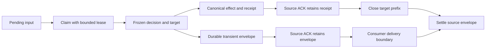

# Operator inbox delivery protocol

Status: implemented after validated baseline `9d0b63a685d8ac165f1083781854fae601c827dd`, with focused and independent combined acceptance. Final full regression and publication qualification are separate gates. This document describes the contract and maintenance boundaries; it does not authorize deployment or claim a real-state migration.

## Why the protocol is needed

The 9d built-in inbox drains a JSONL line and advances its offset before canonical operator intake. If canonical persistence then fails, an ordinary retry can miss the instruction even though the original bytes remain. Moving the offset write after the canonical append would introduce another failure: a crash between effect and ACK could append a once directive twice or repeat a preference/revocation.

The replacement separates input acceptance, authority application and consumer delivery. The source queue owns stable identity and a frozen decision. The actual physical OperatorContext target owns an atomic effect plus receipt. Temporary guidance remains in a durable envelope until its selected consumer reaches a defined boundary.



Source ACK and source settlement are different operations. ACK never deletes the envelope immediately. No queue lock is held during Manager classification, canonical lock waits, prompt assembly or model execution.

## Storage and identity

`apps/_inbox_protocol.py` stores new input in `.inbox-replay/queue.sqlite3`, with a separately durable protocol/queue identity marker. The source marker/schema is version 2; version 1 was a private development component and is rejected rather than silently upgraded. Each complete JSONL payload enters one SQLite transaction using `synchronous=FULL`. The producer reports success only after commit. Failure of the advisory `life.inbox.queued` event does not turn an already committed enqueue into a reported rejection.

The advisory event's lock wait is capped at 0.2 seconds after durable enqueue. A busy event log cannot hold the input acknowledgement for its ordinary 30-second lock timeout. Queue pressure returns HTTP 429 and unavailable/busy queue storage returns HTTP 503 on the nudge endpoint; neither response claims acceptance. This does not impose a deadline on an in-progress filesystem write or `fsync`.

Every physical stream has a persistent UUID, generation, monotonically increasing sequence, original byte range and SHA256 of its complete original line. The public identity is:

```python
{"stream": "...", "generation": 1, "sequence": 1, "digest": "..."}
```

The exposed text and producer source come from the validated raw line; the redundant text column must agree. Per-row digests bind the original consumer/mission/stage, frozen plan/target/transient envelope and accepted receipt. Source ACK flags must agree with the durable stream prefix. Equal text at two positions is two messages, even when their raw digests match. Closed source prefixes and the last enqueue timestamp survive envelope deletion. Missing/replaced databases, mismatched markers, changed complete-line digests, generation changes and invalid legacy cursors fail closed; none is treated as permission to start a fresh cursor.

Source generation is currently fixed at 1, and source streams are never automatically evicted or rotated. Canonical receipt storage can accept a higher generation only after the previous generation's receipts are closed; it thereafter rejects older-generation application. There is no source rotation or manual database-editing procedure in this implementation.

## Queue API

The public queue functions are re-exported by `apps/_inbox.py`.

| API | Contract |
| --- | --- |
| `queue_inbox_message(root, text, source=..., stage="")` | Credential normalization, durable enqueue, then advisory event |
| `claim_inbox_message(root, consumer="engineer", current_stage="", mission_id="", lease_seconds=30)` | Returns `InboxClaim` or `None`; claims at most the head of each eligible stream. No input and no protocol returns `None` without creating state |
| `freeze_inbox_decision(root, claim, decision=plan, target_root=..., transient_text="")` | Persists one immutable plan, actual resolved target and transient payload under owner/lease CAS |
| `accept_inbox_claim(root, claim, receipt=...)` | Requires a frozen plan; canonical acceptance verifies its receipt, while transient acceptance makes its envelope durable |
| `acknowledge_inbox_claim(root, claim)` | Advances the source's durable acknowledged prefix after acceptance; keeps the envelope |
| `settle_inbox_claim(root, claim, canonical_closed=False)` | Deletes an acknowledged envelope after the selected boundary; authority requires successful target closure and `canonical_closed=True` |
| `renew_inbox_claim(...)` / `release_inbox_claim(...)` | Renew or relinquish ownership without acknowledging or deleting input |
| `count_pending_inbox_messages(root)` / `pending_inbox_status(...)` | Read-only count and bounded head diagnostics; retained envelopes count as pending delivery |
| `latest_durable_inbox_timestamp(root)` | Read-only latest input time, retained after settlement for operator presence |
| `migrate_legacy_inbox(root, writers_stopped=True)` | Explicit offline migration; the caller attests that all old shared writers are stopped |

`InboxClaim` carries the identity, original text/source and queue stage, first-claim mission/consumer/consumer-stage binding, owner token, lease deadline, frozen plan/target/transient text, accepted canonical receipt and acknowledged flag. `closed_prefix` returns only `stream`, `generation` and `sequence`. Callers must use returned claims and must not mutate their nested payloads to invent a new decision.

Every mutation checks identity, owner token and the unexpired lease. Expiry permits a new owner; it does not let the old owner freeze, accept, ACK or settle afterward. Each stream retains at most one claimed or acknowledged head. Releasing a lease retains all frozen state. A receiver that already owns an envelope renews that claim rather than repeatedly claiming it.

Unclassified and transient recovery requires the original consumer, mission and consumer stage. Frozen canonical recovery may run under another consumer/mission, because it applies only the previously frozen plan at the original target; the returned original binding does not change. This also lets any consumer finish canonical closure after ACK without classifying again.

## Canonical authority API

The canonical helpers are exposed through `core/operator_context.py`:

1. `freeze_operator_intake(root, text, decision, source="operator.inbox", mission_id="", global_root=None)` returns JSON `{version: 1, target_root: str, effect: dict | None}` without applying authority. It preserves the selected project/global physical namespace and original mission binding.
2. `apply_operator_delivery(plan, identity)` holds that physical target's existing lock and checkpoints the effect and delivery receipt together. A replay before closure returns the original receipt/revision, including after a once directive was consumed. Reusing the identity with a changed raw digest or effect is rejected.
3. `close_operator_delivery_prefix(target_root, prefix)` closes receipts only after source ACK. Source settlement follows successful closure. A replay of an already closed sequence cannot recreate its instruction.

The receipt has format `operator-delivery-receipt-v1` and contains `identity`, `target_root`, `effect_digest` and the original `revision`. Its effect digest binds the **entire frozen plan**, not only the `effect` member:

```python
hashlib.sha256(
    (json.dumps(plan, ensure_ascii=False, sort_keys=True, allow_nan=False) + "\n")
    .encode("utf-8")
).hexdigest()
```

This uses JSON's default separators. The queue checks the receipt's format, identity, resolved target and effect digest before accepting it. Canonical storage locks only the selected target; it cannot replace the source queue's freeze/CAS protection against retargeting between project and global stores.

The first successful canonical delivery application, including an explicit no-op application, moves that target checkpoint to `operator-context-v3` with `state.delivery_replay`. Ordinary checkpoints without delivery metadata remain v2. A v2 checkpoint carrying delivery metadata and a v3 checkpoint missing it are invalid. Exact 9d's reader recognizes v2 and must reject the v3 header; this is a specific compatibility boundary, not a claim that every older version is safely fenced.

The built-in receiver treats `effect=None` as transient: it passes `target_root=None` to the source freeze and does not create a canonical no-op receipt merely to ACK temporary input.

## Consumer delivery and Stop

`apps/_inbox_delivery.py::DurableInboxReceiver` performs classification, freeze, canonical acceptance/closure or transient delivery. Its bounded heartbeat renews held leases while classification or canonical work is pending. Stop checks run before classification, after classification and before effect/application transitions. A Manager adapter that converts cancellation to an empty result must not cause a fallback plan to be frozen after Stop.

| Consumer | Transient settlement boundary |
| --- | --- |
| Engineer | `EngineerInboxGuidance` retains selected physical delivery IDs. `skills/loop_prompt.py::PromptContextMixin._build_round_prompt` settles them only after the complete round prompt assembly succeeds, including later required prelude/context assembly, and no Stop is observed |
| Supervisor/Planner | The selected IDs survive display/text deduplication. The planning cycle settles after an accepted durable Planner result: committed work, an active durable waiting contract, or accepted completion; merely reading input into a prompt or returning a plain wait is insufficient |
| Pending-question resolver | Settlement requires a successful resolver result with `resolved=True` at its defined durable item/transcript boundary. Failure or an unresolved result releases the lease and retains delivery |

A prompt assembly exception or Stop releases ownership without deleting transient input. Canonical effects already accepted before Stop are not rolled back. A crash after effect+receipt and before source ACK replays the original receipt; after source ACK it resumes target closure and source settlement without applying again.

Canonical delivery may still be returned as an `OperatorInboxText` for presentation, but `operator_live_turn` excludes it from fresh live-turn authority. Otherwise replaying a consumed once instruction through the raw-text channel could resurrect it despite canonical idempotence. Temporary messages retain their physical IDs through consumer settlement even when identical display text is deduplicated.

`messaging/inbox.py::PeerAwareInbox` keeps peer processing separate from the built-in operator receiver. Peer advice does not become operator permission. A host-supplied plain `Callable[[], str | None]` retains its own weaker compatibility contract; it cannot express durable claim/accept/ACK. The old built-in `drain_inbox_messages` and raw reader now raise `InboxProtocolError` so built-in consumers cannot bypass the protocol.

These are input-delivery boundaries, not exactly-once inference. Classification can repeat if the process dies before freeze. A process can die after successful prompt assembly but before model dispatch, or after external execution but before another outcome is recorded. Provider execution requires separate provider-supported idempotency to make a stronger claim.

## Pressure, diagnostics and cleanup

| Bound | Behavior when reached |
| --- | --- |
| Source: 64 streams including closed prefixes | Refuse a new stream; never evict a closed identity to admit it |
| Source: 1,024 retained messages/envelopes, 16 MiB total raw input | Refuse admission without dropping pending or acknowledged-but-unsettled input |
| Per item: 128 KiB complete encoded input, 144 KiB decision, 16 KiB receipt | Reject the oversized transition |
| SQLite: 16,384 fixed 4 KiB pages (64 MiB), full auto-vacuum | Refuse database growth beyond the cap; settlement reclaims storage. Journal overhead is bounded by the database size |
| Source lease: positive, at most 300 seconds; normal receiver uses 30 seconds | Expiry allows a new owner. A backward clock jump cannot silently extend the owner beyond the cap |
| Queue activation/write-lock contention: 0.2 seconds | Report bounded contention; never hold this lock across model or canonical work |
| Canonical target: 64 stream tombstones and 256 unclosed receipts | Raise `OperatorDeliveryCapacityError`; the source keeps input pending. Prefixes are not evicted |

The 16 MiB limit counts original raw input only. The database also stores normalized text, frozen envelopes, receipts and indexes; their actual storage is governed by the separate 64 MiB database cap. The decision limit allows an admitted near-128 KiB encoded message plus its bounded plan metadata, so a valid long message is not inherently impossible to freeze. Existing canonical authority can still reach its configured context budget (`OperatorContextCapacityError`), independently of receipt pressure, and require explicit handling while the source retains input.

The canonical 64-stream limit belongs to the physical target. A global target shares that allowance across its source projects and stages. Lease cleanup has an independent short advisory-lock budget, while individual SQLite operations have their own timeout; these do not establish a strict 0.2-second total cleanup deadline.

`InboxBusy` means bounded local contention, `InboxLeaseLost` means the caller must stop using the old owner, `InboxPressure` means admission/transition was refused, and `InboxProtocolError` means state must not be reset to make progress. `InboxMigrationRequired` and `InboxPartialLine` identify explicit legacy recovery prerequisites. Required intake failures remain visible through the consuming runtime rather than silently degrading canonical authority to optional recall.

A transient or unclassified message whose original mission/stage never resumes stays retained. `pending_inbox_status` reports `original_consumer_mission_stage_required`; it is not silently delivered to a new mission or age-pruned. Other eligible streams can proceed, but this stream stays blocked and admission can eventually reach pressure. An operator-directed expiry/rerouting workflow is not implemented by this component.

Do not delete the database, identity marker, stream tombstones, retained envelopes or canonical prefixes to clear pressure. A state copy must preserve source protocol state together with the relevant target checkpoints. Never roll gateway billing state back with a project snapshot.

## Explicit legacy migration and writer isolation

Read-only legacy queries count only complete, valid, unconsumed text lines, ignore incomplete tails for counting, and report `migration_required`. They do not create a database, migrate files, take an immediate write transaction or advance `inbox.offset`. An empty claim also creates no state. Only a producer or explicit migration activates the new protocol.

For existing input, stop all old processes that can write or consume the shared inbox, then use the explicit migration API on an offline copy before considering real-state migration. `writers_stopped=True` is an assertion by the caller; the function does not discover, stop or lock out every old executable. This documentation does not authorize a live migration.

A partial legacy line prevents migration without acknowledging its bytes. Complete the original line while writers are stopped and retry. Truncated files, out-of-range offsets, offsets inside lines, invalid complete pending records and pressure are errors. Interrupted activation retains bounded original archives; a retry imports them in one transaction. A successful migration removes those archives.

Known legacy `inbox.jsonl` and `inbox.<stage>.jsonl` paths become directories with a version marker. This blocks old fixed-path appenders and prevents old raw drains from advancing their offsets. It cannot prevent an old process inventing a previously unknown stage filename. The new protocol detects such a file and fails closed; coordinated old/new writer isolation is still required. Canonical v3 rejection by exact 9d is a separate protection and cannot establish universal rollback safety.

## Acceptance evidence and remaining gates

The private v1 queue component passed 38 focused tests and 13 independent checks. Its evidence remains pinned to v1. Version 2 adds raw/text consistency, binding/envelope/receipt integrity, source-prefix consistency and aligned payload limits; its 61 focused tests, Ruff and two-source-module mypy passed. Coverage includes actual process exit after ACK, transaction rollback, stale-owner mutations, corrupted payload columns, frozen targets/effects, near-limit instruction freeze, partial lines, interrupted migration, source replacement, pressure, concurrent consumers and read-only status/presence behavior. Independent v2 and combined-integration results must be recorded against their exact source, rather than relabeling v1 evidence.

The combined source-v2 snapshot passed 422 related repository tests and 41 independent checks. Ordinary-runner probes cover both consumers, Stop before freeze/application, atomic canonical effect before failed source acceptance/ACK, once consumption and compaction before retry, pending-question and Planner commit failures, selected-message settlement, lease ownership and corrupt envelope rejection. Exact old-reader rejection and three near-128 KiB encoded payloads have separate source-bound receipts. The subsequent advisory-event wait correction has a preserved failing HTTP probe and eight passing focused checks.

Final full regression, image/browser binding and publication qualification remain separate gates. The older 9d image does not contain this protocol. Historical failures and partial paid-model evidence remain unchanged; no new paid run, deployment, restart or real-state migration is claimed here.
