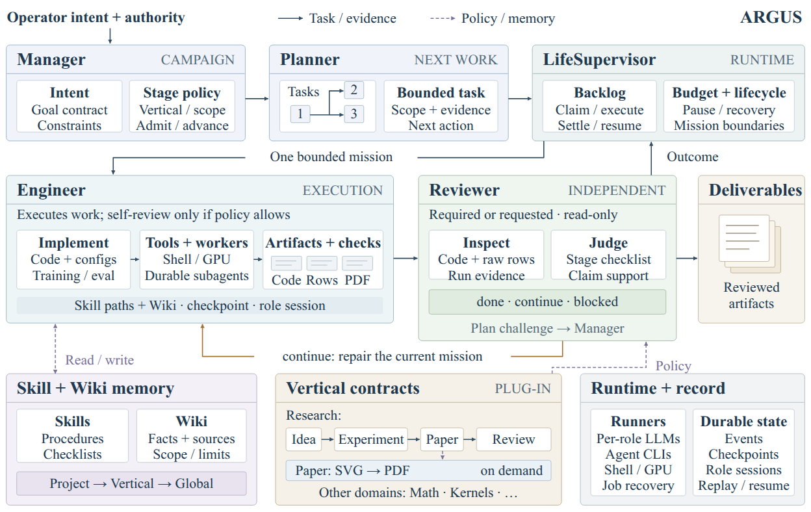

# Legacy SVG export utility

The supported figure entry is Figure Studio: default Method D, fallback Method B.
This page documents only the exporter used by existing examples.

Invocation is on demand: normally design a given figure once when Paper needs
it, then reuse its SVG/PDF across rounds. Neither stage entry nor ordinary
writing, narrative editing, compilation or Review automatically calls the tool.
Only a method change, explicit user request or concrete figure defect calls for
revision. A layout-only repair reuses the known code/paper context.

The default manuscript asset is the **vector PDF**, inserted after the end of
**Introduction**, preferably at the top of **page 2 or 3**. The Engineer checks
the compiled paper and adjusts the LaTeX float, without redrawing the image.
The actual author kit and Introduction length govern final pagination; avoid
forced blank pages or artificial page breaks.



The [real Argus framework example](examples/argus-framework/README.md) is grounded
in the current implementation and technical report. It expands campaign control,
bounded execution and review, shared knowledge, domain contracts, and durable
runtime state. It includes [editable SVG](examples/argus-framework/architecture.source.svg)
and [vector PDF](examples/argus-framework/architecture.pdf). This illustrates the
expected component coverage for a complex architecture, without inventing
modules or shrinking type to make it dense.

A runnable [retrieve–rerank–extract example](examples/retrieval-demo/method.py)
also includes [method prose](examples/retrieval-demo/method.md), its
[preview](examples/retrieval-demo/pipeline.png), and a
[vector PDF](examples/retrieval-demo/pipeline.pdf). Run its code with
`python docs/examples/retrieval-demo/method.py`. This is a small illustrative
method, not an evaluated research result.

## Legacy export compatibility

Research figure workflows now use default Method D and Method B fallback via
`engineer/paper-framework-figure-studio.md`. The standalone SVG workflow and
its Engineer skill have been removed. The low-level exporter below remains
for reproducing existing sources and examples; it is not a workflow entry.

For a manual run, select the actual manuscript sections and method code:

```bash
python -m argus_skill.verticals.research.pipeline_figure brief \
  --project-root . --paper paper/main.tex --paper paper/sections/method.tex \
  --code src/model.py --code src/train.py
```

The command prints a source-grounded design brief for the active model. It
reads only the files explicitly named, includes line numbers, and rejects an
oversized input instead of silently dropping context. Supply direct included
sections and relevant code dependencies explicitly. The model then writes
`paper/figures/src/method_pipeline.svg`; `brief` itself does not generate a figure.

```bash
python -m argus_skill.verticals.research.pipeline_figure render \
  --input paper/figures/src/method_pipeline.svg \
  --output paper/figures/method_pipeline.svg --pdf --png --width 624
```

The tool requires Playwright/Chromium (`pip install 'argus-skill[visual-web]'`,
then `python -m playwright install chromium`) and an installed copy of Times
New Roman. It checks the actual font used for every label, including fallback
glyphs, and reports a missing font instead of silently using a substitute.
The PDF embeds fonts; editable SVG viewers need Times New Roman installed too.

All visible elements belong inside `<g id="pipeline-content">`. The exporter
crops to its bounds with a small safety margin, applies Times New Roman,
checks horizontal aspect and minimum 8 pt type at the requested width, and
optionally exports a preview PNG and vector PDF. `--width 624` means 6.5 inches;
match the author kit's available figure width. Source SVG remains untouched,
and an authoring error leaves existing exports intact.

The model must inspect the PNG, fix internal whitespace, collisions and
incorrect connections, then rerender. Successful export checks geometry and
font facts; it does not certify scientific correctness or visual quality.
Use the PDF with `\includegraphics[width=\linewidth]` and compile the paper.

## Reproduce the Argus framework example

```bash
python -m argus_skill.verticals.research.pipeline_figure render \
  --input docs/examples/argus-framework/architecture.source.svg \
  --output docs/examples/argus-framework/architecture.svg --pdf --png --width 624
```
