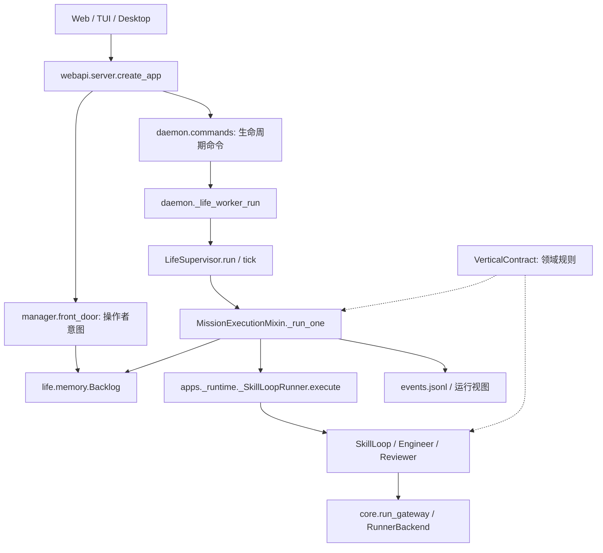

# Runtime 维护地图与重构任务

本轮基线：`9598b1a04`，2026-09-12。目标是让维护者沿着入口找到状态所有者、
提交点和恢复路径，并能局部修改行为。本文描述代码结构；它不进入任何角色 prompt。
概念定义见 [Core Concepts](CORE_CONCEPTS.md)。

## 阅读入口



这是调用与数据依赖图，不是独立部署单元图。Manager 的路由、Planner 的生成任务、
Reviewer 的语义判断和 Host 的状态提交发生在不同位置；定位行为时先区分决策与落盘。

| 要修改的行为 | 从这里读起 | 必须保持的边界 |
| --- | --- | --- |
| 操作者意图入队、修改目标 | [`manager/front_door.py`](../argus_skill/manager/front_door.py) | 目标版本和任务入队一起核对，陈旧模型结果不能覆盖新目标 |
| 项目调度、等待、规划 | [`life/supervisor/_core.py`](../argus_skill/life/supervisor/_core.py) 的 `run` / `tick` | 调度拥有何时运行；单任务执行拥有如何结束 |
| 单任务执行与早退 | [`_mission_execution.py`](../argus_skill/life/supervisor/_mission_execution.py) 的 `_run_one` | 先 claim；先核对 claim 是否失效，再结算任务 |
| 任务到角色循环的组装 | [`apps/_runtime.py`](../argus_skill/apps/_runtime.py)、[`apps/_runtime_execute.py`](../argus_skill/apps/_runtime_execute.py) | `_SkillLoopRunner` 实现 supervisor 所需的执行接口，`SkillLoop` 驱动角色回合 |
| 单任务临时字段 | [`_mission_execution_helpers.py`](../argus_skill/life/supervisor/_mission_execution_helpers.py) 的 `_MissionRunState` | 字段显式声明，临时结果不能直接充当持久完成证据 |
| 任务领取、状态、终态归档 | [`life/memory.py`](../argus_skill/life/memory.py) 的 `Backlog` | 所有读改写遵循同一个 Backlog 锁与恢复协议 |
| 阶段推进与回退 | [`manager/_stage_ops.py`](../argus_skill/manager/_stage_ops.py)、[`skills/stage_machine.py`](../argus_skill/skills/stage_machine.py) | Manager 决策及提交，Vertical 提供规则，状态机执行规则 |
| 模型调用与后端 | [`core/run_gateway.py`](../argus_skill/core/run_gateway.py)、[`core/ports.py`](../argus_skill/core/ports.py) | provider 进程与解析细节留在 adapter / agent_cli |
| 展示状态与事件回放 | [`life/event_log.py`](../argus_skill/life/event_log.py)、[`core/mission_view`](../argus_skill/core/mission_view) | 展示投影不负责决定任务或项目完成 |

## 状态所有权

这些状态描述不同层面的事实，不能因为都叫 `done` 就互相代替。

| 状态 | 写入责任与入口 | 生命周期 / 恢复 |
| --- | --- | --- |
| 操作者目标、验收与版本 | Manager front door / GoalContract | 持久事实；后来的模型结果必须核对当前版本 |
| 任务身份、依赖、领取者与终态 | `Backlog.claim_next`、`update`、`mark_done` 等 | 持久；活跃队列与归档采用 Backlog 自己的提交和恢复协议 |
| 单次执行上下文、计费、结果推导 | `_MissionRunState`；各 phase 在字段分组中声明职责 | 进程内；崩溃后不能从此对象继续执行 |
| 阶段状态与完成证据 | Manager → stage machine → `core.pipeline_state` | `.argus/PIPELINE_STATE.json`；兼容读取旧路径；阶段完成不自动等于整个项目完成 |
| 项目完成 | `core.project_api.complete_project` | 校验证据来源后写 lifecycle；不由 UI 或角色会话直接写 DONE |
| daemon 连续运行配置 | `daemon.state` 的 generation / compare-and-swap | 决定是否继续调度；不代替任务验收结果 |
| 角色会话 | `core.role_session` | 可轮换、可重建的上下文；任务权威仍来自持久任务与契约 |
| 事件与运行视图 | `JsonlEventLog` → `core.mission_view` | 事件追加与投影更新不是同一事务；投影不能成为执行权威 |

## 单任务执行顺序

`_run_one` 是单次任务的导航入口。沿着以下顺序检查代码，避免只看最终 `status`：

1. **领取与路由**：原子领取候选任务，解析执行工作目录，补齐 Manager 路由。
2. **准备上下文**：生成 handoff/context 引用，设置 usage attempt、事件与执行配置。
3. **执行与计量**：调用 runner，恢复临时替换的配置，推导运行结果和用量。
4. **检查早退**：先处理失效的 claim，再处理可恢复的预算/provider 暂停和外部工作等待。
5. **评审后处理**：结算 repair capability，检查动态计划与阶段条件。
6. **继续还是结束**：先让 Vertical 判断需要继续的结果缺口；未进入该路径时处理阶段短路。
7. **持久结算与报告**：确定 Backlog 状态，再记录 journal / outcome event 并返回结果。

早退也可能已经写入计费、暂停或阶段状态。具体返回路径及副作用以 `_run_one`
的入口文档和分支回归测试为准；不要把一次返回值直接解释成项目完成。

## 恢复与并发边界

- Backlog 锁保护同一项目队列的读取、恢复和修改；工作目录 lease 另外保护执行目录所有权。
- 任务恢复以持久 Backlog 状态为起点。确实遗留的 `running` 可以按 orphan 策略重新排队；
  已经提交的终态必须保持终态。
- 修复归档提交不能保证外部操作只执行一次。调用外部服务、提交长实验等操作仍需要稳定操作标识、
  结果查询或对账；不能仅凭模型会话里有一句“完成”跳过核验。
- Manager pipeline lock 当前仍跨整个 supervisor pass 持有。外部意图提交通过 yield 握手
  等待任务边界；本轮没有改变这个并发契约。
- 事件、视图、阶段、项目 lifecycle 与 daemon 配置分别提交。本轮没有把这些文件变成一个事务，
  也没有把 event log 升级为唯一事件溯源数据库。

### Backlog 完成提交协议

入口收敛在 `Backlog._locked`（先恢复）和 `Backlog._save`（写入）。发生终态变更时：

1. 保存 `backlog.commit.json`：版本、原 archive 字节偏移、本次终态行和提交后的活跃行。
   文件写入、同步与原子替换完成后，这份记录就是需要完成的提交；即使调用者随后看到 I/O 异常，
   也不能按旧的 `running` 状态重领任务。
2. 从记录的偏移写入本次 archive 后缀并截断多余尾部。恢复重做同一步不会重复追加终态行。
3. 原子替换活跃 backlog。
4. 将 commit 文件缩为版本标记。下次访问无需恢复；正常任务领取只处理活跃队列。

所有公开 Backlog 读取和修改在同一把锁内先完成待恢复提交。没有版本标记的旧数据，
首次访问会对账 archive/live 重叠，让已归档终态优先于旧的非终态副本；之后不再每次扫描历史。
损坏或未知版本的提交记录应直接报错，不得返回空队列或擅自删除记录。
依赖 backlog 文件的展示缓存也必须把 commit 文件纳入失效条件；否则可能一直命中旧视图，
绕过本应触发恢复的 Backlog 读取。MapFeed 的回归测试同时覆盖带事件与仅任务两种读取。
文件集合统一由 `Backlog.storage_paths` 暴露，缓存和备份调用者不再自行猜测组成。
Watch 读取 `active()`，Follow 为开始/完成事件补上下文时读取 `history()`；两者都通过存储恢复入口。

POSIX 下同步文件和父目录；Windows 下同步文件并原子替换，不宣称具备同等目录断电耐久性。
上线此存储协议前须停止访问同一 backlog 的旧版本写进程，再统一升级；旧写进程不认识提交记录。
既有 archive/live 行格式保持兼容，新增加的 commit 文件负责恢复。

## 常见问题如何追踪

| 现象 | 先查的事实 | 后续代码入口 |
| --- | --- | --- |
| 一个任务显示完成，但项目仍在运行 | Backlog 任务终态、当前阶段、项目完成证据、continuous generation 分别是什么 | `project_api.complete_project` → Supervisor 的 bounded/open-ended 完成路径 |
| 页面停止更新，事件仍在增加 | event log 是否追加成功，Mission View 是否落后 | `JsonlEventLog._append` → `core.mission_view` 的 reducer / snapshot |
| 重启后再次运行一个任务 | commit 是否待恢复，live/archive 中的同一任务 ID，orphan 重试次数 | `Backlog._recover_commit` → `reap_orphans`；外部操作另外对账 |
| 修改目标迟迟未生效 | 指令是否已接收，Manager yield 请求与 pipeline lock，当前执行是否到达任务边界 | `front_door` → `manager._session_ops` → `daemon._life_worker_run` |
| 阶段回退被拒绝 | 当前 Vertical 契约的回退能力与目标阶段顺序 | `stage_rollback_error` → `_set_stage`；不是按领域名称猜规则 |

排查时先用 project ID、mission ID 和模型调用的 call ID 对齐记录；角色会话中的描述
只能辅助理解，不能替代 Backlog、契约版本和实际产物。

## 已安排的任务

状态只反映本分支的实现与验证；不表示已经发布或部署。

| 编号 / 优先级 | 状态 | 边界与交付物 | 验收条件 / 依赖 |
| --- | --- | --- | --- |
| M1 / P0 完成提交恢复 | 已实现并验证 | `Backlog`：明确 archive/live 的提交权威与恢复入口；Web/终端读取同步恢复 | 提交记录落盘后任一应用步骤失败，重启不重领该任务；恢复再中断可重试；正常 claim 不新增历史扫描 |
| M2 / P1 显式执行状态 | 已实现并验证 | `_MissionRunState` 与 `_run_one`：声明全部字段、阶段职责和早退副作用 | 保持当前执行行为和磁盘格式；覆盖 claim 失效、暂停、继续迭代、阶段短路、正常结算 |
| M3 / P1 领域规则归位 | 已实现并验证 | `VerticalContract` 声明回退能力；状态机负责规则 | research 行为保持；自定义名字的 Vertical 可声明同一能力；允许回退的领域保持原行为 |
| M4 / P1 API 依赖明确化 | 待实施 | 从 `project_crud` / `mission_items` 开始，把 `_srv()` 回调改为显式传入所需服务；`create_app` 负责组装 | 两个 app 实例依赖独立；领域服务不再导入 `server`；迁移对应 API 测试后删兼容入口；最后迁移 daemon lifecycle/upgrade |
| M5 / P1 缩短控制面锁 | 待实施，依赖 M1/M2 | Manager 意图接收与安全边界应用分开；模型调用和长任务执行移出状态提交锁 | 指令接收有持久确认；expected revision 冲突可见；并发修改不丢目标，不让陈旧执行完成新任务；保留工作目录单写约束 |
| M6 / P2 拆出独立调度组件 | 待实施，依赖 M2/M3 | 按上下文准备、运行结果结算、规划输入分批替换共享 `self` 的 mixin | 每批组件输入/输出和副作用可列清；调用者不再需要其内部字段；对应原 mixin 删除；保留任务级集成测试 |
| M7 / P2 投影恢复对账 | 待实施 | 事件到 Mission View 增加明确的持久进度与重放边界 | 日志成功、投影失败后可补齐；重复重放不重复计数；旧事件与轮转日志兼容 |

下一批先做 M4，再做 M5；M6 按具体依赖边界逐个迁移。每个任务单独形成可审查补丁，
不把 API、存储格式、阶段语义和部署方式同时改掉。

## 修改后的验证

本批整合验证（2026-09-12，Linux / Python 3.12）：运行时与架构回归 **560 项通过**，
Web/终端回归 **86 项通过**；全仓 `ruff check argus_skill tests` 与 `git diff --check` 通过。
存储与显式运行状态还经过交叉代码审查；故障恢复测试使用临时目录中的真实子进程退出。

本地开发使用已安装依赖的 Python；以下命令不启动真实模型，也不部署服务：

```bash
python -m pytest tests/life/test_backlog_commit_recovery.py tests/life/test_mission_execution_contract.py tests/skills/test_stage_rollback_policy.py tests/apps/test_backlog_views.py tests/webapi/test_map_incremental.py
python -m pytest tests/test_architecture_invariants.py tests/core/test_contract_authority.py tests/core/test_event_catalog.py
python -m pytest tests/life/test_memory.py tests/life/test_memory_split.py tests/life/test_backlog_dag.py tests/life/test_backlog_replacement.py tests/life/test_state_machine_guards.py
python -m pytest tests/life/test_supervisor.py tests/life/test_backend_failure_circuit.py tests/life/test_result_shortfall_iteration.py tests/life/test_bounded_dag_staged_workflow.py
python -m pytest tests/core/test_vertical_contract.py tests/skills/test_stage_checklists.py tests/manager/test_deterministic_stage_advance.py tests/manager/test_stale_stage_transition.py
```

并发和故障恢复要用相应的临时目录/多进程测试验证。单元测试通过不代表真实 provider
的长期任务成功率，也不能用全套测试数量代替一次状态变更的恢复证据。

## 持续维护的要求

- 改一个持久字段时，一起检查其写入者、旧版本读取、崩溃恢复和展示投影。
- 新增领域规则先放进 Vertical 契约；不要在多个编排模块添加领域名称判断。
- 给运行结果增加字段时，在显式数据结构中声明，并注明最早在哪个 phase 有效。
- 出现第二个“重试所有者”时先合并恢复责任，避免不同层同时重试同一外部操作。
- 拆模块时移动责任及依赖，而不是把大对象方法分散到更多共享实例状态的文件里。
- 修改上述入口或所有权时同步更新本文；自动化测试保护行为，本文提供导航。
