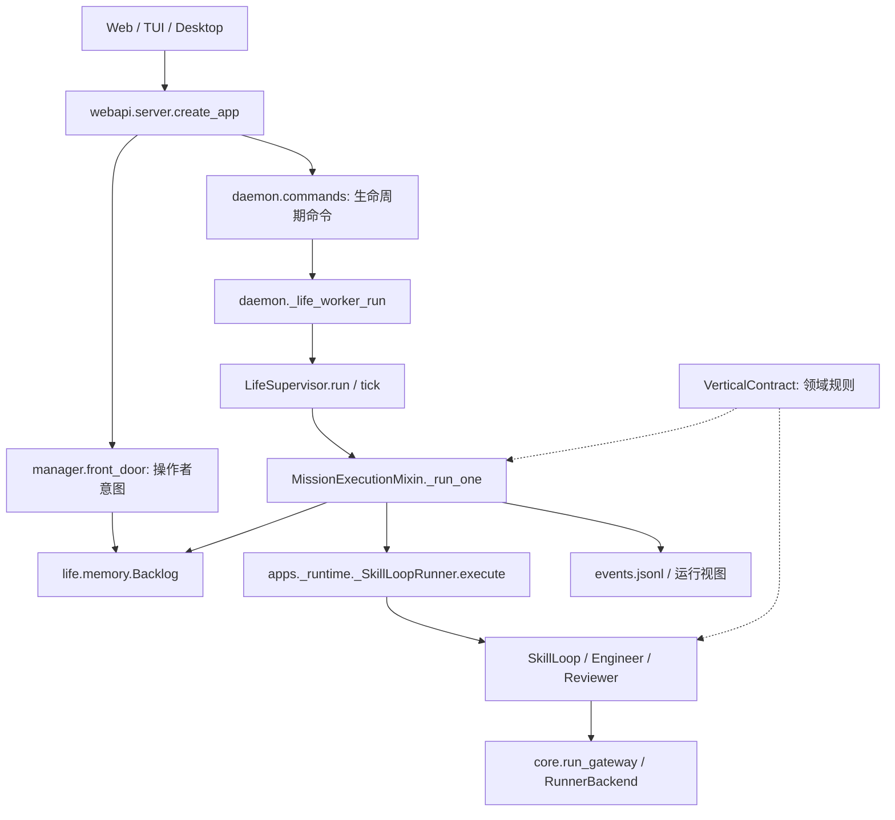

# Runtime 维护地图与重构任务

本轮基线：`9598b1a04`，2026-09-12。目标是让维护者沿着入口找到状态所有者、
提交点和恢复路径，并能局部修改行为。本文描述代码结构；它不进入任何角色 prompt。
概念定义见 [Core Concepts](CORE_CONCEPTS.md)。

第二批从 `9885fb19f` 继续，并合并 `origin/main` 的 `1e09263e1`。
这一批明确 API 服务依赖、完善控制面等待和事件投影恢复，并收敛并发查询的失败行为。

## 2026-09-23 调用路径精简

CLI adapter 在构造时直接导入仓库内的 `AgentCliRunner`，使用真实 `RunnerOptions`；
不再维护字符串依赖字典或兼容旧测试类型的字段探测。测试只替换执行入口。

领域调用先取 `load_vertical_contract(name, project_root=...)`，随后直接读取
`stage_order`、`completion_gate` 等字段，或调用 `completion_issues()`、
`assess_iteration()`、`automatic_stage_completion_ready()`。同一操作复用合同对象，
自动阶段关闭仍要求 provider 明确返回布尔值。`argus-verticals` 已使用的旧访问入口
保留兼容；已移除的其余逐字段包装入口应改为对应合同属性或方法。

内部调用直接访问实现所在模块，runtime 门面只保留实际跨包入口和社区插件
使用的兼容入口。任务完成时，`_CostTrackingSink.completion_usage()` 一次读取账本，
同时生成总量与角色明细；完成事件复用该结果，避免分别读取字段时混入后来的记账。

Web API 路由只接收 `app` 和 `ServerContext`，直接调用 `daemon_lifecycle`、
`daemon_upgrade`、`mission_items`、`project_crud`、`project_state` 等实现模块。
`server.py` 保留 app 构建、运行入口和事件流；原先从 server 转出的业务函数改从
所属模块导入。包级 `argus.webapi.build_snapshot` 和 `project_life_dir` 入口保留。
命令 ID、版本校验和收据通过 daemon 路由内的同一个执行入口处理；多根目录的项目
列表与费用列表共用目录归属规则，缓存和 daemon 服务仍由各 app 独立持有。

## 阅读入口



这是调用与数据依赖图，不是独立部署单元图。Manager 的路由、Planner 的生成任务、
Reviewer 的语义判断和 Host 的状态提交发生在不同位置；定位行为时先区分决策与落盘。

| 要修改的行为 | 从这里读起 | 必须保持的边界 |
| --- | --- | --- |
| 操作者意图入队、修改目标 | [`manager/front_door.py`](../argus/manager/front_door.py) | 目标版本和任务入队一起核对，陈旧模型结果不能覆盖新目标 |
| 项目调度、等待、规划 | [`life/supervisor/_core.py`](../argus/life/supervisor/_core.py) 的 `run` / `tick` | 调度拥有何时运行；单任务执行拥有如何结束 |
| 单任务执行与早退 | [`_mission_execution.py`](../argus/life/supervisor/_mission_execution.py) 的 `_run_one` | 先 claim；先核对 claim 是否失效，再结算任务 |
| 任务到角色循环的组装 | [`apps/_runtime.py`](../argus/apps/_runtime.py)、[`apps/_runtime_execute.py`](../argus/apps/_runtime_execute.py) | `_SkillLoopRunner` 实现 supervisor 所需的执行接口，`SkillLoop` 驱动角色回合 |
| 单任务临时字段 | [`_mission_execution_helpers.py`](../argus/life/supervisor/_mission_execution_helpers.py) 的 `_MissionRunState` | 字段显式声明，临时结果不能直接充当持久完成证据 |
| 任务领取、状态、终态归档 | [`life/memory.py`](../argus/life/memory.py) 的 `Backlog` | 所有读改写遵循同一个 Backlog 锁与恢复协议 |
| 阶段推进与回退 | [`manager/_stage_ops.py`](../argus/manager/_stage_ops.py)、[`skills/stage_machine.py`](../argus/skills/stage_machine.py) | Manager 决策及提交，Vertical 提供规则，状态机执行规则 |
| 模型调用与后端 | [`core/run_gateway.py`](../argus/core/run_gateway.py)、[`core/ports.py`](../argus/core/ports.py) | provider 进程与解析细节留在 adapter / agent_cli |
| 项目/任务 HTTP 服务依赖 | [`webapi/daemon_services.py`](../argus/webapi/daemon_services.py)、`create_app` / `ServerContext` | 每个 app 持有自己的状态读取和启动服务；业务函数仅接收所需操作 |
| 并发查询合并、失败、等待超时 | [`webapi/index_cache.py`](../argus/webapi/index_cache.py) | 一轮查询共享结果或失败；超时不启动重复扫描 |
| 展示状态与事件回放 | [`life/event_log.py`](../argus/life/event_log.py)、[`core/mission_view`](../argus/core/mission_view) | 展示投影不负责决定任务或项目完成 |

## 状态所有权

这些状态描述不同层面的事实，不能因为都叫 `done` 就互相代替。

| 状态 | 写入责任与入口 | 生命周期 / 恢复 |
| --- | --- | --- |
| 操作者目标、验收与版本 | Manager front door / GoalContract | 持久事实；后来的模型结果必须核对当前版本 |
| 任务身份、依赖、领取者与终态 | `Backlog.claim_next`、`update`、`mark_done` 等 | 持久；活跃队列与归档采用 Backlog 自己的提交和恢复协议 |
| 单次执行上下文、计费、结果推导 | `_MissionRunState`；各 phase 在字段分组中声明职责 | 进程内；崩溃后不能从此对象继续执行 |
| 阶段状态与完成证据 | Manager → stage machine → `core.pipeline_state` | `.argus/PIPELINE_STATE.json`；兼容读取旧路径；阶段完成不自动等于整个项目完成 |
| 项目完成 | `core.project_api.complete_project` | 校验证据来源后写 lifecycle；不由 UI 或角色会话直接写 DONE |
| daemon 连续运行配置 | `daemon.state` 的 generation / compare-and-swap | 决定是否继续调度；不代替任务验收结果 |
| 角色会话 | `core.role_session` | 可轮换、可重建的上下文；任务权威仍来自持久任务与契约 |
| 事件与运行视图 | `JsonlEventSink` → `core.mission_view` | 日志先落盘，视图与已消费位置原子保存；失败由读取补齐，投影不承担执行权威 |

## 单任务执行顺序

`_run_one` 是单次任务的导航入口。沿着以下顺序检查代码，避免只看最终 `status`：

1. **领取与路由**：原子领取候选任务，解析执行工作目录，补齐 Manager 路由。
2. **准备上下文**：生成 handoff/context 引用，设置 usage attempt、事件与执行配置。
3. **执行与计量**：调用 runner，恢复临时替换的配置，推导运行结果和用量。
4. **检查早退**：先处理失效的 claim，再处理可恢复的预算/provider 暂停和外部工作等待。
5. **评审后处理**：结算 repair capability，检查动态计划与阶段条件。
6. **继续还是结束**：先让 Vertical 判断需要继续的结果缺口；未进入该路径时处理阶段短路。
7. **持久结算与报告**：确定 Backlog 状态，再记录 journal / outcome event 并返回结果。

早退也可能已经写入计费、暂停或阶段状态。具体返回路径及副作用以 `_run_one`
的入口文档和分支回归测试为准；不要把一次返回值直接解释成项目完成。

## 恢复与并发边界

- Backlog 锁保护同一项目队列的读取、恢复和修改；工作目录 lease 另外保护执行目录所有权。
- 任务恢复以持久 Backlog 状态为起点。确实遗留的 `running` 可以按 orphan 策略重新排队；
  已经提交的终态必须保持终态。
- 修复归档提交不能保证外部操作只执行一次。调用外部服务、提交长实验等操作仍需要稳定操作标识、
  结果查询或对账；不能仅凭模型会话里有一句“完成”跳过核验。
- Manager pipeline lock 当前仍跨整个 supervisor pass 持有。外部意图提交通过 yield 握手
  等待任务边界；本轮没有改变这个并发契约。
- 阶段、项目 lifecycle、daemon 配置仍分别提交。事件日志与视图也分别写入，
  但视图与已消费日志位置属于同一个 checkpoint；日志不代替这些执行状态的权威。

### Backlog 完成提交协议

入口收敛在 `Backlog._locked`（先恢复）和 `Backlog._save`（写入）。发生终态变更时：

1. 保存 `backlog.commit.json`：版本、原 archive 字节偏移、本次终态行和提交后的活跃行。
   文件写入、同步与原子替换完成后，这份记录就是需要完成的提交；即使调用者随后看到 I/O 异常，
   也不能按旧的 `running` 状态重领任务。
2. 从记录的偏移写入本次 archive 后缀并截断多余尾部。恢复重做同一步不会重复追加终态行。
3. 原子替换活跃 backlog。
4. 将 commit 文件缩为版本标记。下次访问无需恢复；正常任务领取只处理活跃队列。

所有公开 Backlog 读取和修改在同一把锁内先完成待恢复提交。没有版本标记的旧数据，
首次访问会对账 archive/live 重叠，让已归档终态优先于旧的非终态副本；之后不再每次扫描历史。
损坏或未知版本的提交记录应直接报错，不得返回空队列或擅自删除记录。
依赖 backlog 文件的展示缓存也必须把 commit 文件纳入失效条件；否则可能一直命中旧视图，
绕过本应触发恢复的 Backlog 读取。MapFeed 的回归测试同时覆盖带事件与仅任务两种读取。
文件集合统一由 `Backlog.storage_paths` 暴露，缓存和备份调用者不再自行猜测组成。
Watch 读取 `active()`，Follow 为开始/完成事件补上下文时读取 `history()`；两者都通过存储恢复入口。

普通 mission 结算现在使用 v2 提交：任务状态、独立的 `mission_result` 和待发完成事件绑定保存，
恢复仍兼容 v1。`mission-deliveries/` 仅保存未确认事件，属于完整备份集合；
`mission-events.index.jsonl` 是可重建的投递索引。稳定 delivery ID 防止写入成功、确认失败后重复完成。
已确认索引也会核对原日志行，避免日志截断或恢复旧快照后错误省略补发。
缺失索引或备份 inode 失配时需要冷扫描保留日志；事件行缓冲有上限，索引内存仍随完成数量增长。

完成事件和最小 transcript 回执先于可选学习交付。失败的 sink/确认可在后续 tick 或重启后重试，
不重新执行已经结算的任务；实际学习费用仍以 UsageLedger 为准。该保证覆盖普通结算与持久回执，
不表示每条 WebSocket 消息、外部通知或所有早退分支都具备恰好一次交付。

POSIX 下同步文件和父目录；Windows 下同步文件并原子替换，不宣称具备同等目录断电耐久性。
上线此存储协议前须停止访问同一 backlog 的旧版本写进程，再统一升级；旧写进程不认识提交记录。
既有 archive/live 行格式保持兼容，新增加的 commit 文件负责恢复。

### API 服务依赖

`create_app(daemon_services=DaemonServices(read_status=..., start=...))` 为单个 app
提供两个窄操作，默认在 app 创建时捕获具体实现。`ServerContext` 保存该实例。
`project_crud.delete_project` 只接收状态读取操作；`mission_items.get_status` 接收状态读取操作，
`enqueue_task_command` 接收启动操作。项目和任务业务模块不再导入 `server` 或 `_server_module`。

测试直接注入服务，或 patch 实际业务模块，避免依赖 `server` 的全局名字转发。
HTTP 路径、返回结构与直接 Python 调用保留兼容。`daemon_lifecycle` / `daemon_upgrade`
内部仍有旧的反向依赖，后续迁移；这批没有把所有后台服务宣称为完全实例隔离。

### 查询缓存的失败与等待契约

`IndexCache.get(key, compute)` 对同 key 的并发读只执行一份 `compute`：

- 正常完成：共享只读结果，缓存到有限 TTL；显式失效会把旧的进行中查询与新读隔离。
- 查询失败：当前等待者收到该次失败；失败不缓存，后来的新请求可以再试。缓存层不替等待者循环重试。
- 等待超过 30 秒：抛出 `CacheWaitTimeout`，HTTP 返回 `503`、`detail` 和 `Retry-After: 1`。
  原查询继续运行，完成后仍能供后来的请求复用；其他 key 不被它阻塞。
- 非有限 TTL（如 `inf`、`nan`）按无效配置处理并禁用缓存，避免可变快照永久不更新。

该等待上限约束跟随者，不会强行中止执行查询的线程。外部 I/O 自身仍需要各自的超时。
缓存键表最多保留 64 项；不同 key 的容量耗尽路径仍直接执行，不承担全局请求限流。

以上 30 秒与容量旁路描述保留的同步 Python 接口。HTTP 的项目列表、成本、回收站和 snapshot
已改用异步等待，以及每 app 独立的查询执行池：默认 2 个执行线程、6 个排队任务、64 个等待请求，
请求最多等待 10 秒。容量满时返回可重试 503，不启动无额度的扫描；请求取消不撤销其他等待者的扫描。
关闭 app 会取消尚未开始的任务并有界等待，已经进入同步 I/O 的线程仍需等该 I/O 返回。

网页试用门户的鉴权数据库读取在线程中进行，结果只缓存于当前请求；后续请求重新检查撤权。
每租户连接池分为普通数据、目标修改、紧急停止三组，默认上限分别为 100、2、4。
关闭持续运行走停止池。门户保留经过校验的 `Retry-After`，仍对后端错误正文脱敏。

### 控制面等待与取消

bounded 与 continuous handoff 都在提交前请求让出任务边界。当前任务结束后，Supervisor
会先让 Manager 提交，再继续领取后续任务；这里提供任务边界让出，不承诺严格 FIFO。

每个等待者持有 `.manager_pipeline_yields/<token>.json`，请求者只释放自己的记录，
无需共同读改写一份队列表或获取额外 metadata 锁。释放先记录 `released` 再删除文件，
删除失败不会继续阻塞 daemon。旧 `.manager_pipeline_yield.json` 保留读取兼容。
进程存活统一使用 `core.daemon_lock.is_pid_running`，避免在 Windows 上误用 `os.kill(pid, 0)`。

`manager_pipeline_boundary` 把取消回调传给原生 `Manager.pipeline_lock`；daemon 传入 stop 信号，
Web TEAM 请求通过 `enqueue_mission` 传入原有取消回调。锁竞争可等待，取消可在等待期间退出；
坏文件描述符、锁服务不可用等真正故障直接抛出，不伪装成永久竞争。旧无参锁替身只做进入前后检查。

完整缩短持锁范围仍有两个前提：执行上下文不能再临时修改共享 Manager/Runner 字段，
任务结算须全程绑定目标版本与 claim。当前保留执行期间的粗锁与工作目录所有权。

Web Manager 请求在打开项目之前记录控制版本；停止或更新目标会使旧请求失效，版本不会在缓存释放后复用。
请求取消通过 `RunExecGateway` 的作用域传入每次模型调用，复制 RunnerOptions，不修改共享 runner；
计划预览和提示改写也走这一入口。持续目标的提交回执绑定后续 daemon 启动，启动前再次检查控制版本和
磁盘 generation，避免停止后被迟到的旧启用请求重新启动。目标仍在安全任务边界应用，未拆除上述粗锁。
外部工作心跳拒绝非有限数值；等待直接观察进程 stop 事件，不再等完轮询 sleep 才响应停止。

### 事件投影恢复

恢复实现集中在 [`core/mission_view/_replay.py`](../argus/core/mission_view/_replay.py)。
`JsonlEventSink` 先追加并同步日志，释放日志锁，再请求投影读取已落盘事件；回调参数不会被重复应用。
reader 和 writer 都遵循 `events.lock` → `mission-view.lock` 的顺序。

`mission-view.json` 内部同时保存视图和 `_event_cursor`。只有这次 checkpoint 成功，
才算消费了对应日志前缀；失败后从上一次 checkpoint 重放，因此不会在半完成状态上再次累计拒绝次数。
游标追踪文件身份、位置和边界内容指纹，能跨轮转定位 retained generation，并适应正常备份复制后的 inode 变化。

旧视图初始化、截断后的重建和落后追赶按字节预算分批；快照的 `projection_sync` 标明
`current`、`catching_up` 或 `waiting_for_line`。未变化的完整快照只检查当前日志元数据，
不打开日志、不枚举历史目录、不重写 checkpoint。API 返回移除内部 `_event_cursor`，保留同步状态供诊断。
直接调用 `update_mission_view_event` 而不写日志的兼容模式标为 `unlogged`，不伪造可恢复日志进度。
直接投影会记录当时日志位置。后续 canonical writer 在每行末尾写 `log_writer_version`，
reader 从基准位置有界查找这个 Host 标记，并能跨分块、轮转继续查找；接管不依赖投影回调成功，
也不依赖最后一行恰好来自 canonical writer。纯旧格式人工 review tail 保留原兼容行为。

回放统一复用 `validate_event_envelope`：生产写入保持默认严格校验，旧日志允许缺失较新的必需字段，
已提供字段仍检查类型和值。损坏 JSON、无效记录和超大行计入 `skipped_rows` / `oversized_rows`，
原始日志保持完整；超大行的跳过进度也持久保存，不能阻塞后续有效事件。

日志和 checkpoint 的同步写入增加了写路径成本；正常读路径因此可以增量对账。
这项保证覆盖日志到视图的恢复，不改变外部任务操作的幂等责任。

Web 实时 tail 与地图历史现在共用 `core/jsonl_reader.py` 的有界读取器。
tail 保留旧日志句柄，先排空未读数据再跟进保留世代；超长行分批跳过，普通半行等待补齐。
历史索引将跳行进度与 SQLite 页一起提交，归一化和 SQL 写入位于日志锁之外。单批读取最多为预算加
1 MiB 和 1 字节；未变化 tail 不打开日志或枚举历史。历史索引版本更新为 5，旧游标按原重建协议重置。

## 常见问题如何追踪

| 现象 | 先查的事实 | 后续代码入口 |
| --- | --- | --- |
| 一个任务显示完成，但项目仍在运行 | Backlog 任务终态、当前阶段、项目完成证据、continuous generation 分别是什么 | `project_api.complete_project` → Supervisor 的 bounded/open-ended 完成路径 |
| 页面停止更新，事件仍在增加 | event log 是否追加成功，Mission View 是否落后 | `JsonlEventSink._append` → `core.mission_view` 的 reducer / snapshot |
| 重启后再次运行一个任务 | commit 是否待恢复，live/archive 中的同一任务 ID，orphan 重试次数 | `Backlog._recover_commit` → `reap_orphans`；外部操作另外对账 |
| 修改目标迟迟未生效 | 指令是否已接收，Manager yield 请求与 pipeline lock，当前执行是否到达任务边界 | `front_door` → `manager._session_ops` → `daemon._life_worker_run` |
| 阶段回退被拒绝 | 当前 Vertical 契约的回退能力与目标阶段顺序 | `stage_rollback_error` → `_set_stage`；不是按领域名称猜规则 |

排查时先用 project ID、mission ID 和模型调用的 call ID 对齐记录；角色会话中的描述
只能辅助理解，不能替代 Backlog、契约版本和实际产物。

## 已安排的任务

状态只反映本分支的实现与验证；不表示已经发布或部署。

| 编号 / 优先级 | 状态 | 边界与交付物 | 验收条件 / 依赖 |
| --- | --- | --- | --- |
| M1 / P0 完成提交恢复 | 已实现并验证 | `Backlog`：明确 archive/live 的提交权威与恢复入口；Web/终端读取同步恢复 | 提交记录落盘后任一应用步骤失败，重启不重领该任务；恢复再中断可重试；正常 claim 不新增历史扫描 |
| M2 / P1 显式执行状态 | 已实现并验证 | `_MissionRunState` 与 `_run_one`：声明全部字段、阶段职责和早退副作用 | 保持当前执行行为和磁盘格式；覆盖 claim 失效、暂停、继续迭代、阶段短路、正常结算 |
| M3 / P1 领域规则归位 | 已实现并验证 | `VerticalContract` 声明回退能力；状态机负责规则 | research 行为保持；自定义名字的 Vertical 可声明同一能力；允许回退的领域保持原行为 |
| M4 / P1 API 依赖明确化 | 首批已实现并验证 | `project_crud` / `mission_items` 的反向依赖改为显式操作；`create_app` 组装 `DaemonServices` | 两个 app 的服务独立；架构测试禁止回查 server；后续继续迁移 daemon lifecycle/upgrade |
| M5 / P1 缩短控制面锁 | 前置改善已实现并验证 | bounded/continuous handoff 让出任务边界；取消和停止可中断锁等待；真实锁错误直接报出 | 保留粗锁；最终短锁依赖共享 Manager/Runner 上下文隔离，以及结算全过程 goal revision/claim CAS |
| M6 / P2 拆出独立调度组件 | 待实施，依赖 M2/M3 | 按上下文准备、运行结果结算、规划输入分批替换共享 `self` 的 mixin | 每批组件输入/输出和副作用可列清；调用者不再需要其内部字段；对应原 mixin 删除；保留任务级集成测试 |
| M7 / P2 投影恢复对账 | 已实现并验证 | 事件到 Mission View 增加明确的持久进度与重放边界 | 日志成功、投影失败后可补齐；重复重放不重复计数；旧事件与轮转日志兼容 |
| M8 / P1 查询失败合并 | 已实现并验证 | 统一缓存失败/超时语义，避免并发查询放大故障负载 | 40 个同轮失败查询只执行一次扫描；等待超时不重复扫描；后续请求仍能恢复 |

后续继续 M4 的 daemon 服务迁移、M5 的上下文隔离与短提交；M6 按具体依赖边界逐个迁移。每个任务单独形成可审查补丁，
不把 API、存储格式、阶段语义和部署方式同时改掉。

## 修改后的验证

第一批整合验证（2026-09-12，Linux / Python 3.12）：运行时与架构回归 **560 项通过**，
Web/终端回归 **86 项通过**；全仓 `ruff check argus tests` 与 `git diff --check` 通过。
存储与显式运行状态还经过交叉代码审查；故障恢复测试使用临时目录中的真实子进程退出。

第二批主回归：`core` / `life` / `manager` / `daemon` 与关联集成测试 **2,954 项通过、4 项跳过**；
全部 WebAPI 测试 **605 项通过、2 项跳过**。收尾的恢复、锁、缓存、API 服务与架构边界补测
**213 项通过**（与主回归有重叠），后续新增的模式接管/旧字段兼容用例所在三文件 **123 项通过**。
全仓 Ruff 与 diff 检查通过。跳过项使用现有平台/环境条件，本地未运行原生 Windows/macOS 构建。

第三批独立验证（2026-09-12）：先在工程化提交 `38632ee45` 上运行完整 Python 测试，
**9,273 项通过、56 项跳过**。故障注入另外发现非有限数值事件会污染 Mission View，
使地图历史 HTTP 序列化失败，UI 事件响应还可能出现 `null` 时间戳。
现在事件读取统一拒绝 NaN、Infinity 和溢出浮点数；跳过坏行但保留审计源文件，
重建已污染的投影和旧历史缓存，证据查询也过滤尚未迁移的坏缓存记录。

修正执行阶段的可选依赖收窄后，`life` / `manager` / `daemon` **1,952 项通过、4 项跳过**；
全部数值读取修复完成后，`core` / WebAPI / 关联 CLI、事件查询和架构测试
**1,659 项通过、2 项跳过**。共享历史读取补测 **73 项通过**；新增缺陷用例在 Python 3.11
上 **26 项通过**。这些集合有重叠，完整 Python 套件没有在最后修复后再次全部运行。
Web **594 项通过**、TUI **290 项通过、1 项跳过**，二者类型检查及生成协议校验通过。
Python 3.11 下量化相关 **13 项通过**，补充覆盖主环境缺少的 LightGBM 运行时。

真实入口测试使用隔离目录：10 轮崩溃提交恢复中，每轮两个领取进程与一个新增进程竞争，
没有丢失或重复领取；超大半行跨轮转后继续恢复有效事件；只取消一个等待者不撤销另一个等待者
的任务边界请求。Uvicorn 中 40 个并发请求共用一次慢扫描，等待超时返回可重试 503，
随后请求恢复 200；热缓存下仍能恢复待提交任务。公共 daemon 启动入口用 memory backend
完成两项任务并正常停止。该验证不包含真实模型长期负载或原生 Windows/macOS 运行。

静态类型检查仍未整体通过。以相同入口检查导入依赖图，对照改造前 `9598b1a04`
按文件和诊断文本比较：本次新增诊断已清零，现存 **1,433 条**（基线 **1,455 条**）。
这项结果只说明所检查范围没有新增类型诊断，不代表仓库全部类型债务已经清理。

优化证据以受控测试说明边界：40 个同轮失败查询从 40 次扫描变为 1 次；持锁 0.8 秒、
0.1 秒后取消的测试中，三次等待耗时中位数从 0.8009 秒降至 0.2002 秒。
已有超过 400KB 日志新增一条事件时，完整 snapshot 的日志读取量小于 4KB；
未变化 snapshot 的日志打开与历史目录枚举次数均为 0。这些不是部署吞吐量承诺。

本地开发使用已安装依赖的 Python；以下命令不启动真实模型，也不部署服务：

```bash
python -m pytest tests/core/test_mission_view_replay.py tests/manager/test_pipeline_boundary.py tests/daemon/test_pipeline_lock_stop.py tests/webapi/test_daemon_services.py tests/webapi/test_index_cache_failures.py
python -m pytest tests/life/test_backlog_commit_recovery.py tests/life/test_mission_execution_contract.py tests/skills/test_stage_rollback_policy.py tests/apps/test_backlog_views.py tests/webapi/test_map_incremental.py
python -m pytest tests/test_architecture_invariants.py tests/core/test_contract_authority.py tests/core/test_event_catalog.py
python -m pytest tests/life/test_memory.py tests/life/test_memory_split.py tests/life/test_backlog_dag.py tests/life/test_backlog_replacement.py tests/life/test_state_machine_guards.py
python -m pytest tests/life/test_supervisor.py tests/life/test_backend_failure_circuit.py tests/life/test_result_shortfall_iteration.py tests/life/test_bounded_dag_staged_workflow.py
python -m pytest tests/core/test_vertical_contract.py tests/skills/test_stage_checklists.py tests/manager/test_deterministic_stage_advance.py tests/manager/test_stale_stage_transition.py
```

并发和故障恢复要用相应的临时目录/多进程测试验证。单元测试通过不代表真实 provider
的长期任务成功率，也不能用全套测试数量代替一次状态变更的恢复证据。

## 持续维护的要求

- CI 对照变更基线运行相同环境的 mypy，按文件、诊断文本和数量阻止新增类型问题；既有诊断不算已修复。
- 改一个持久字段时，一起检查其写入者、旧版本读取、崩溃恢复和展示投影。
- 新增领域规则先放进 Vertical 契约；不要在多个编排模块添加领域名称判断。
- 给运行结果增加字段时，在显式数据结构中声明，并注明最早在哪个 phase 有效。
- 出现第二个“重试所有者”时先合并恢复责任，避免不同层同时重试同一外部操作。
- 拆模块时移动责任及依赖，而不是把大对象方法分散到更多共享实例状态的文件里。
- 修改上述入口或所有权时同步更新本文；自动化测试保护行为，本文提供导航。
